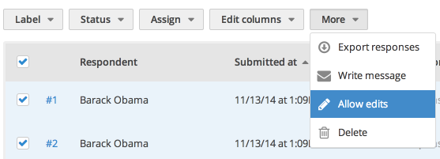
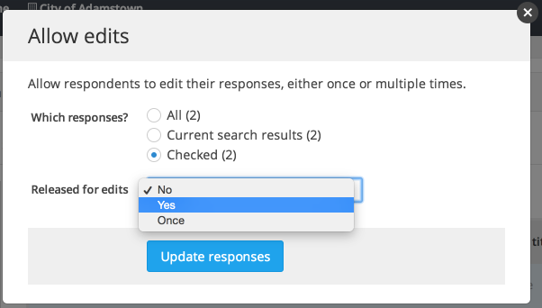
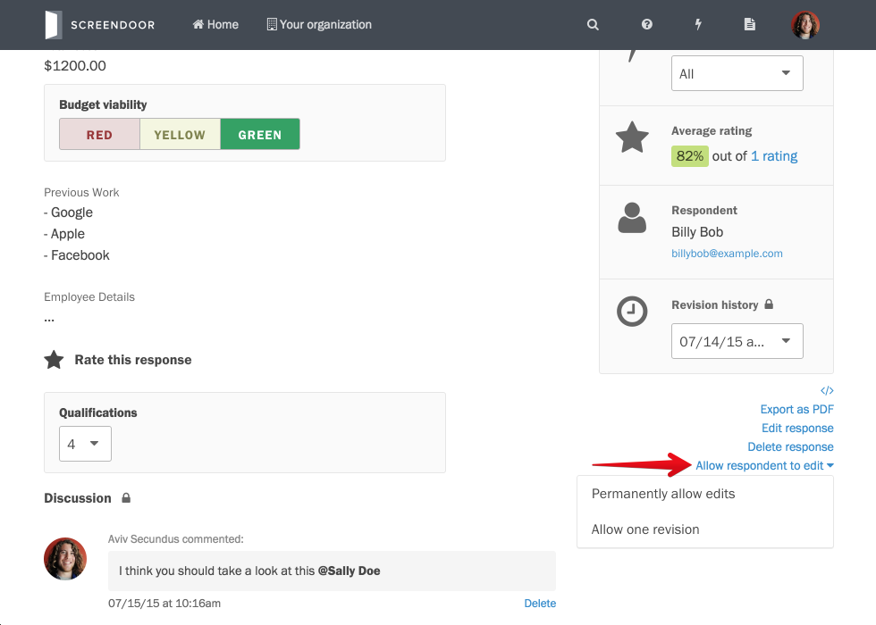
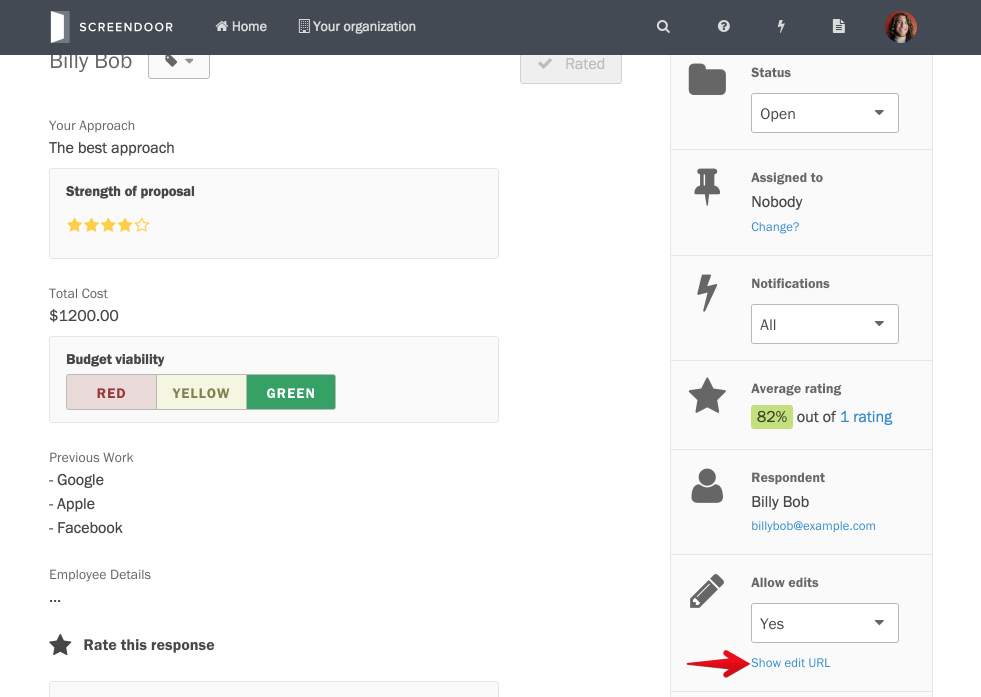
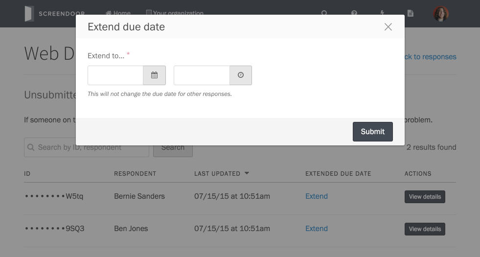
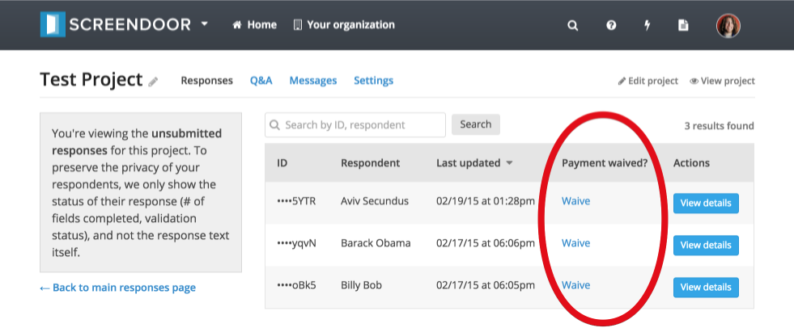

### Allowing respondents to edit their submission

If you'd like your respondents to be able to edit their responses after they have submitted them, select some responses and click "Allow edits" from the "More" dropdown above the "Responses" table.

Then, select "No," "Yes," or "Once" and click the "Update responses" button. "Yes" will enable multiple edits, while "Once" will allow the respondent to edit their response only one time.

    **Note**: You can always go back and disable response editing by selecting "No" from the "Released for edits" dropdown.

If you just want to allow edits to one response, you can also do so from the individual response page (click the response from the "Responses" table to get to this page). Click the "Allow respondent to edit" link (just below the sidebar) and select the appropriate option from the dropdown.

Once you allow edits, you can copy the edit URL and send it to respondents if necessary. Click "Show edit URL" from the sidebar and copy the edit URL from the modal.

### Viewing unsubmitted drafts

To view all unsubmitted responses for your project, navigate to the "Responses" page and click the "View unsubmitted responses" link underneath the statuses and labels section. Note that in order to preserve the privacy of your respondents, you will only be able to view the validation status, respondent name, and last four digits of the response ID for these unsubmitted responses (not their actual contents). However, you can see how many validation errors have occurred so far and how many fields have been completed.

The goal of this page is to help you deal with any problems, issues, or questions that your respondents may encounter while filling out your response form. If a respondent needs help submitting their form, the "View unsubmitted responses" page will enable you to see what point they're at in the form and what they may need help with.

#### Extending the due date for a specific response

To extend the due date for a specific response from the "View unsubmitted responses" page, click the "Extend" link next to the appropriate response and select an extended due date from the date/time picker.

Click "Submit" to extend the due date for that response. Note that this will not affect any other responses.

#### Waiving payment for a specific response

To waive payment for a specific response, click the "Waive" link next to the appropriate response.

