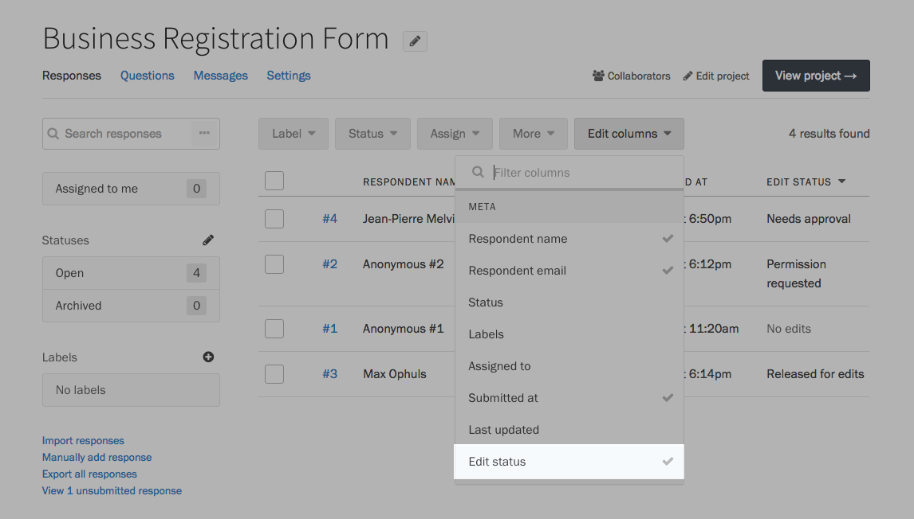
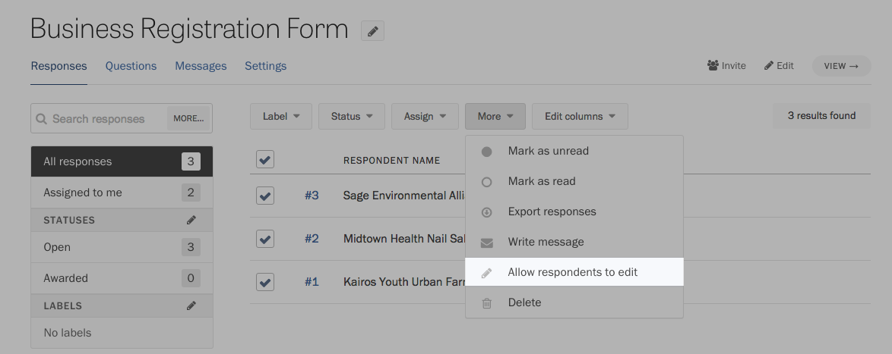
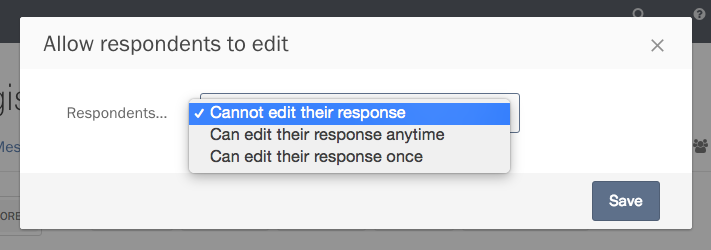
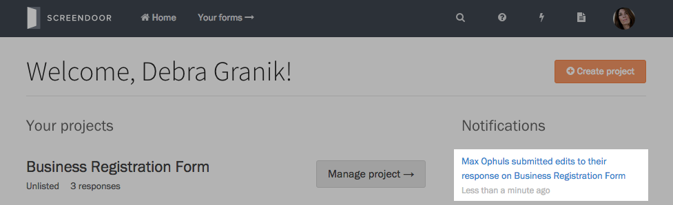
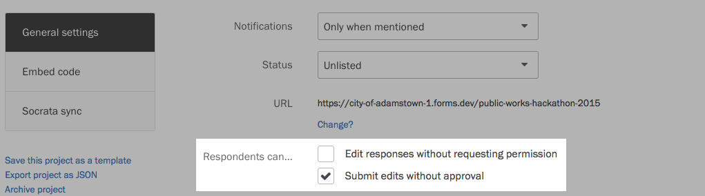

Screendoor provides you with a few tools to help out your respondents during the submission process. Learn more below.

### Allowing respondents to edit their submission

If a respondent submits a form that contains a mistake or outdated information, you might receive a notification from Screendoor that says they have requested permission to edit their response. Click on the notification to view that response, and press the &ldquo;Allow edits&rdquo; button in the alert at the top of the page.

You can allow them to make changes only once or as many times as they'd like, up until the [deadline](/articles/screendoor/projects/deadline.html) (if you have set one).

You can easily view everyone who has requested edit status on your project's Responses page. Press the [&ldquo;Edit columns&rdquo;](/articles/screendoor/responses/viewing_a_list_of_responses.html#configuring-the-responses-table) button just above the table and select &ldquo;Edit status&rdquo; from the dropdown.

Sorting this column lets you see everyone who has requested permission to edit. To grant permission to all of them at once, select these responses using the checkboxes on the left side of the table. Press the &ldquo;More&rdquo; button above the table, and choose &ldquo;Allow edits&rdquo; from the dropdown.

If you want to revoke a respondent's permission to edit, select &ldquo;Allow edits&rdquo; from the dropdown and set it to &ldquo;No.&rdquo;

Respondents will be notified automatically via email that their response is ready to edit. But if the email gets lost in their inbox, you can always send them the link to edit again, if necessary. On any response's page, click the &ldquo;Show edit URL&rdquo; link in the lower right corner.

Copy the link that appears to your clipboard.

### Approving edits made by respondents

After a respondent edits their submission, you will receive a notification that you must approve the changes before they are incorporated into your project.

Click on the notification to visit that response's page.

Press the &ldquo;View pending edits&rdquo; button to review the changes the respondent has made.

Highlighted in blue are the fields that respondents have edited. Press the Commit button to approve the changes and create a new revision of the response, or press the Reject button to discard their changes.

### Automatically approving edits

If you don't want to go through a manual approval process every time a respondent wants to edit their submission, Screendoor lets you automatically approve any change a respondent makes.

Go to your project's Settings page. Under &ldquo;General settings,&rdquo; you can automatically grant respondents the permission to edit, as well as automatically approve a respondent's changes.

### Troubleshooting unsubmitted responses

If your respondents are having problems filling out your form, Screendoor gives you some basic tools to troubleshoot their draft in progress. On your project's Responses page, click the &ldquo;View unsubmitted responses&rdquo; link.

To preserve the privacy of your respondents, you can't view the contents of their draft on this page. But Screendoor gives you enough information to figure out what's stopping them from completing your form. Press the &ldquo;View details&rdquo; button next to any submitted response to take a look.

A modal dialog will appear, showing you the respondent's name and email, the progress they've made, any validation errors in the form, and the time they last edited their draft.

If you find that respondents are repeatedly getting stuck on a specific section of your form, it might be worth taking a look at [our tips to improve your form's usability](/articles/screendoor/your_form/designing_a_great_form.html).

#### Extending the deadline for a draft

If someone can't complete your form by the [deadline](/articles/screendoor/projects/deadline.html) you have set and needs more time, you can extend the deadline for only that response. On the &ldquo;Unsubmitted responses&rdquo; page, press &ldquo;Extend&rdquo; next to their response in progress, and specify a new date and time.

This extended deadline won't affect any other responses, only the one you choose.

#### Waiving payment for a draft

If your project has a [submission fee](/articles/screendoor/your_form/payments.html), and you want to waive the fee for a specific response, click the &ldquo;Waive&rdquo; link next to that response.

