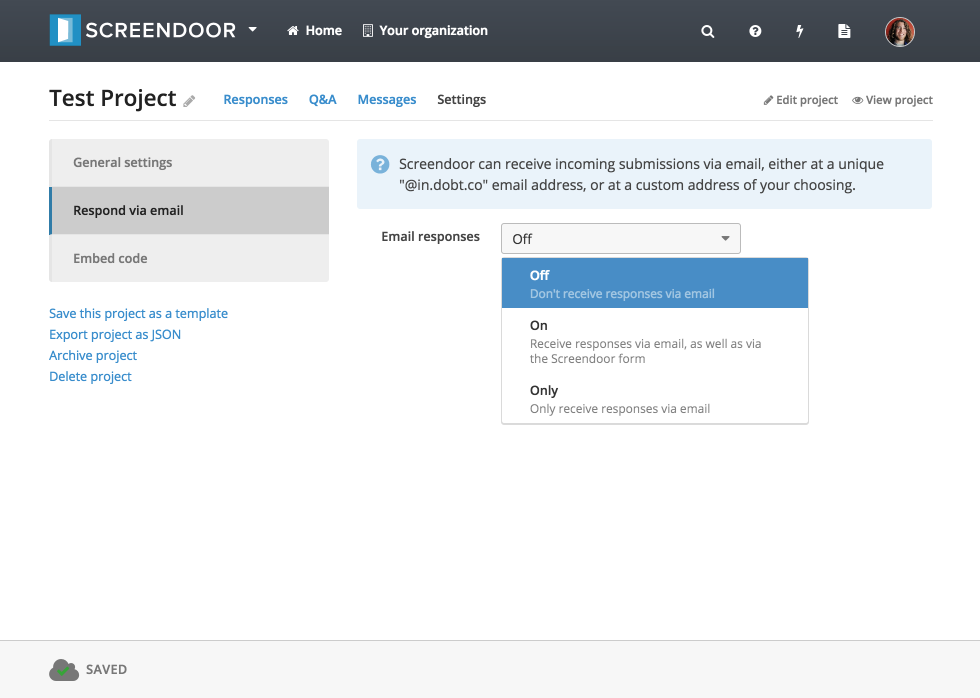
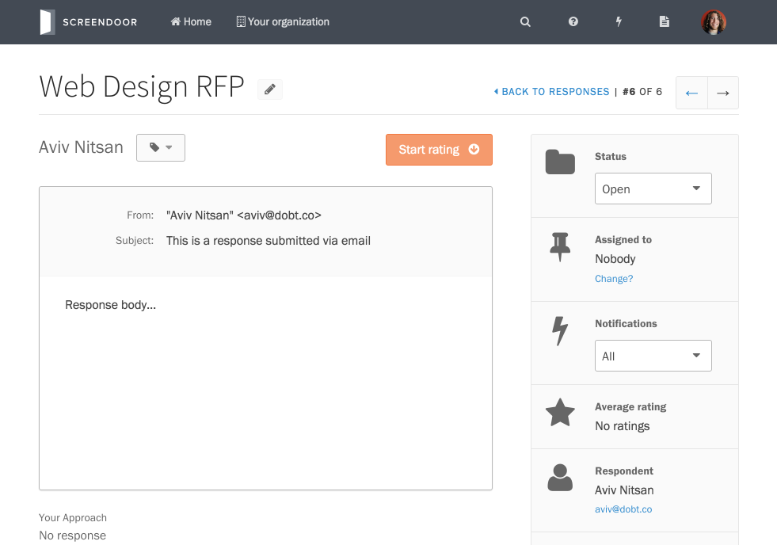
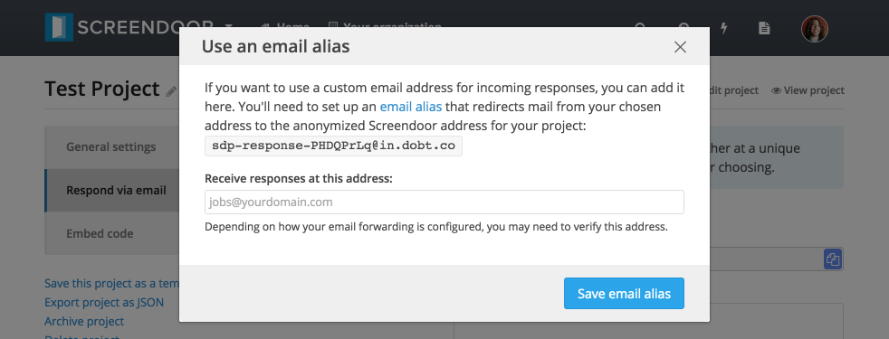
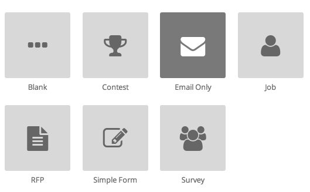

## Receiving responses via email

To receive responses via email, select the "Response via email" box on the "Settings" page for your project. Then, select the appropriate option from the "Email responses" dropdown.

That's it! You can now use Screendoor to organize, manage, and evaluate incoming email responses to your project. This is what a response submitted via email will look like:

## Receiving responses with a custom address

If you would like to use a custom email address for incoming responses (instead of the default address, which is unique to your project and will look something like this: "sdp-response-UMtlSKkU@in.dobt.co"), you can set it up by clicking the "use a custom address" link on the "Respond via email" page. Follow the instructions listed on the "Use an email alias" popup, which include setting up email forwarding from your custom address to the anonymized Screendoor address (and possibly confirming your custom email address).

---

## F.A.Q.

### This all seems too complicated. Is there an easier way to receive email inside of Screendoor?
Yes, there is a simpler way. All you need to do is select the "Shared Inbox" project template when you create your project. This way, your project is pre-configured to receive responses via email.

