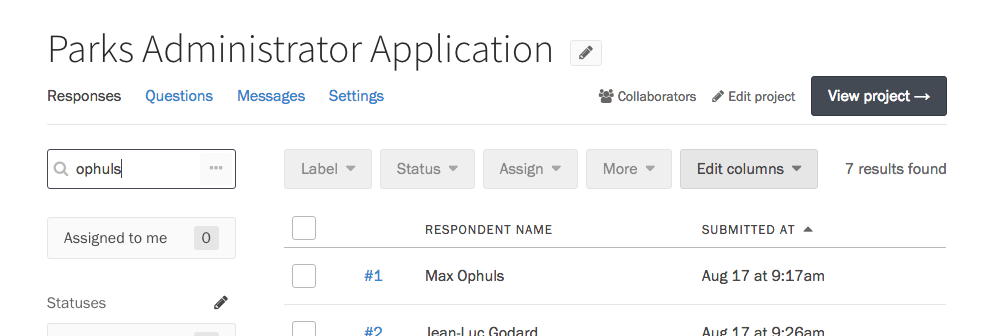
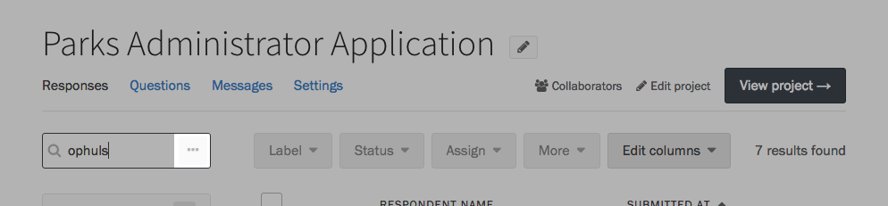
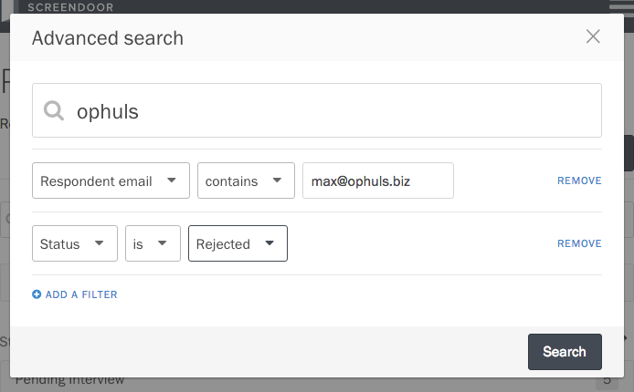
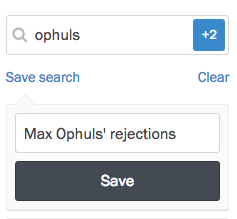
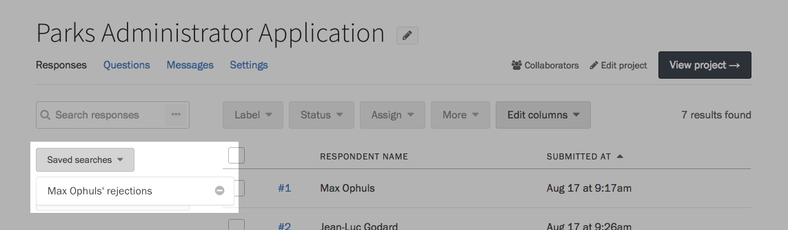
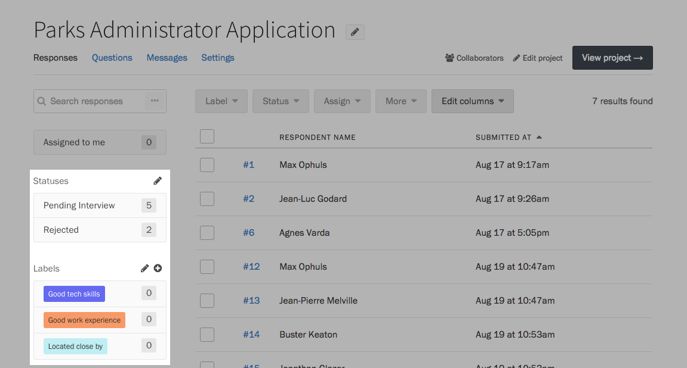

Screendoor offers powerful search tools to find the exact response you're looking for.

### Using simple and advanced search

If you simply want to search for a respondent's name or a specific phrase, use the search bar in the upper left corner of the Responses page.

For more complex queries, press the &ldquo;&hellip;&rdquo; button on the right side of the search input.

Click the &ldquo;Add a filter&rdquo; button to start building your search query. You can limit results by the respondent's name, email, the person assigned, their answer to specific fields, and more. When you're ready, press the Search button to see your results.

If you want to clear your search results and view all of your responses, click the Clear link below the search input.

### Saving a search

If you're conducting the same search queries frequently, you may want to save them to reuse later.

After conducting a search, press the &ldquo;Save search&rdquo; button. You'll be asked to name your search something you can remember it by later.

When you want to conduct your search again, press the &ldquo;Saved searches&rdquo; button and select it in the dropdown.

If you want to remove a saved search from your list, press the Delete icon on the right side of the dropdown item.

### Filtering by statuses and labels

The sidebar of your project's Responses page provides a few handy shortcuts to narrow your search results to a single [status](/articles/screendoor/responses/using_statuses.html) or [label](/articles/screendoor/responses/using_labels.html).

To filter responses by a status or label, click on its name in the sidebar.

To clear the filter, click on it again. 
