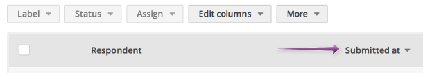
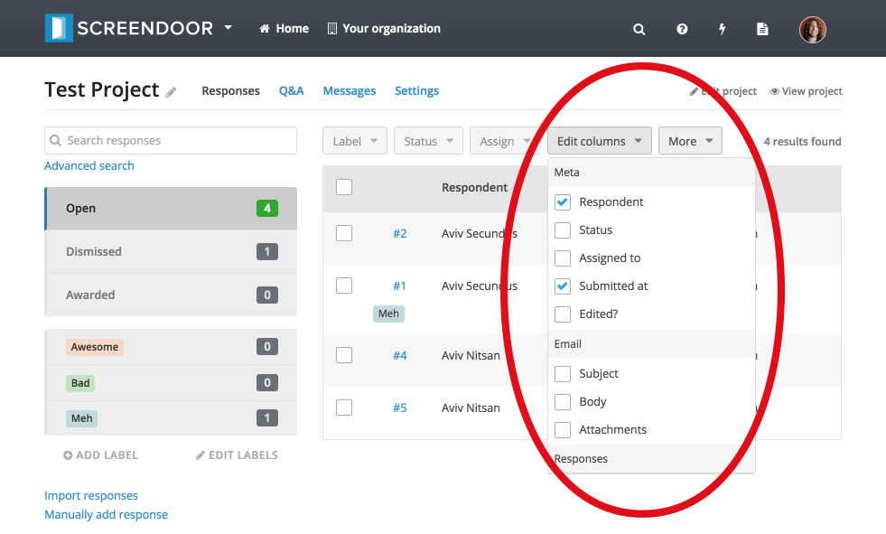
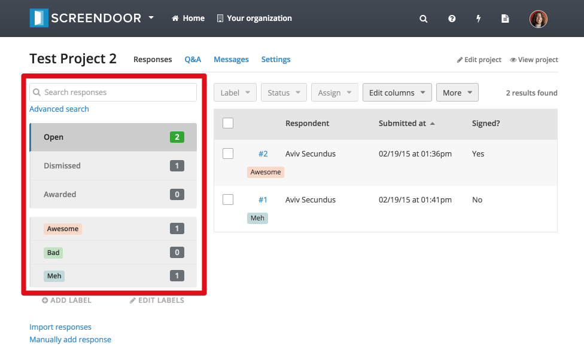
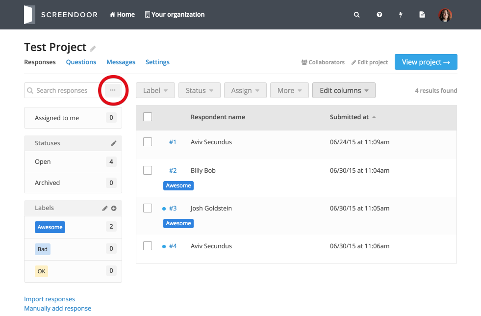
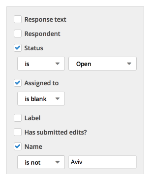
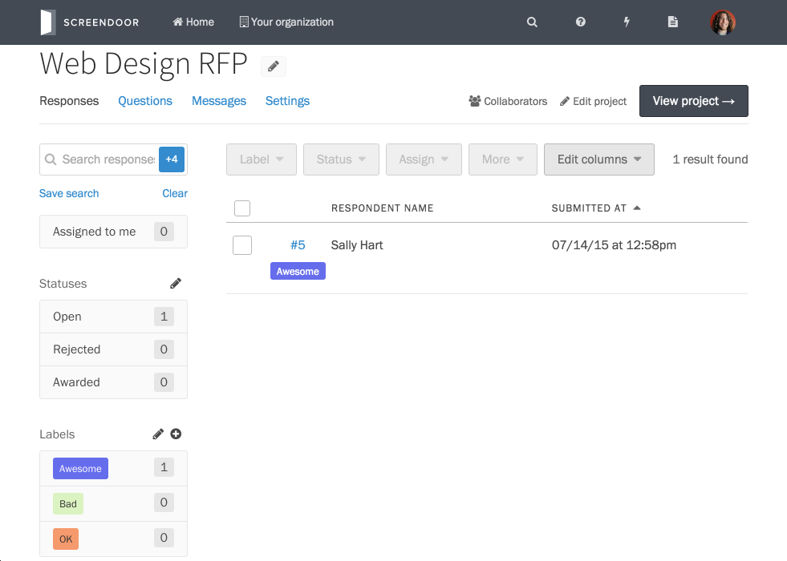
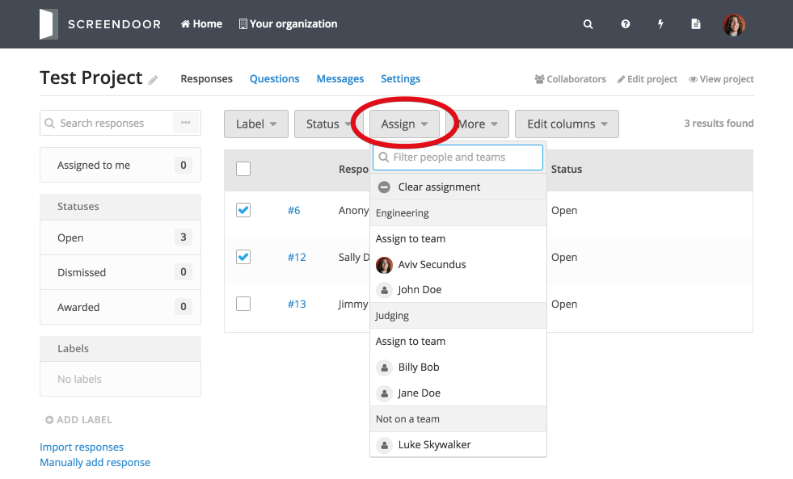
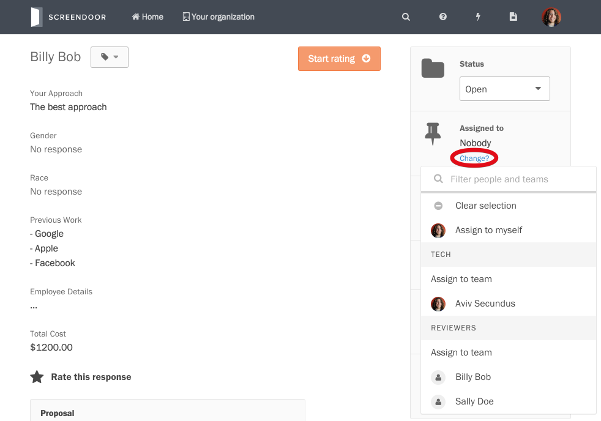

You can sort and filter the responses for your project from the "Responses" page.

## Sorting responses

To sort responses by a specific field, just click that field on the "Responses" table. An up or down arrow will appear next to the field name to indicate that the table is being sorted by that field. To reverse the sort order, click the field again and the arrow will reverse.

If you want to sort by a specific field that is not shown on the table, add that field from the "Edit columns" dropdown and then click it when it appears as a table header.

## Filtering responses

### Filtering by search term

To filter responses by a search term, enter your search term in the "Search responses" field on the upper left-hand side of the "Responses" table and then hit enter.

### Filtering by status

To filter by status, select the box just below the search field that displays the status you would like to filter by. For example, if you only want to display responses that have a status of "Open," select the "Open status" (assuming that "Open" is one of your statuses).

### Filtering by label

You can also filter by label: just select the label you wish to use as a filter from the boxes just below the status selection, on the left-hand side of the "Responses" table. Note that to stop filtering by a label, click the label again to deselect it. A dark gray background indicates a label that is currently being used as a filter, while a light gray background indicates a label that is not currently being used as a filter.

## Advanced search

To perform an advanced search, click the "..." in the search bar on the "Responses" page.

From the "Advanced search" popup, you can create powerful custom search queries. Click "Add a filter" to filter by a variety of criteria.

Then, click "Search" to find all responses that match your query.

### Saving an advanced search

Click "Save search" to save your advanced search for later. You can then retrieve it from the "Saved searches" menu at any time.

## Assigning responses

### Assigning multiple responses

To assign multiple responses to individuals or teams, check the appropriate responses from the "Responses" table and select the appropriate individuals/teams from the "Assign" dropdown.

### Assigning individual responses

To assign a response to individuals or teams from an individual response page, click the "Change?" link under "Assigned to" in the sidebar. Then, select the appropriate individuals/teams from the dropdown.

