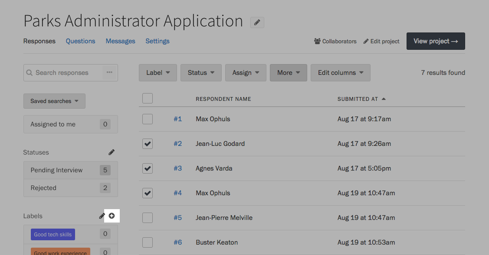
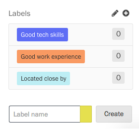
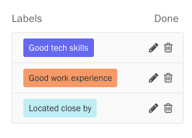
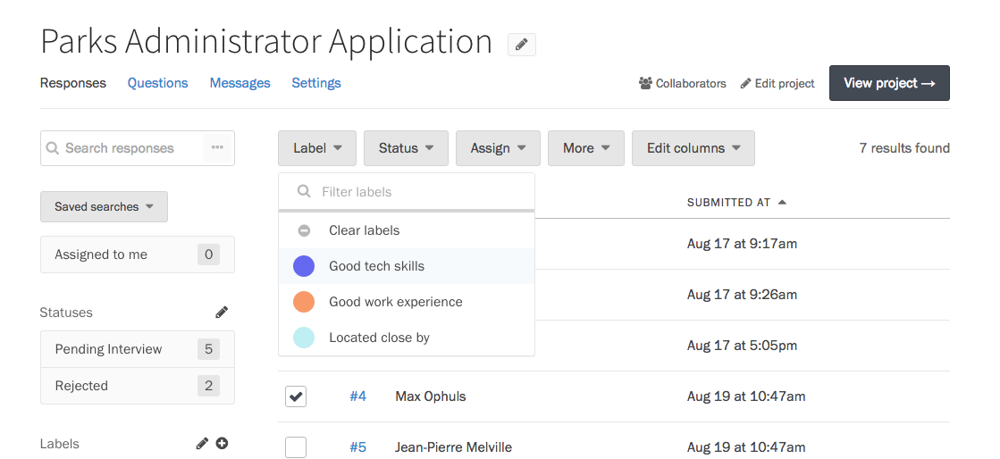
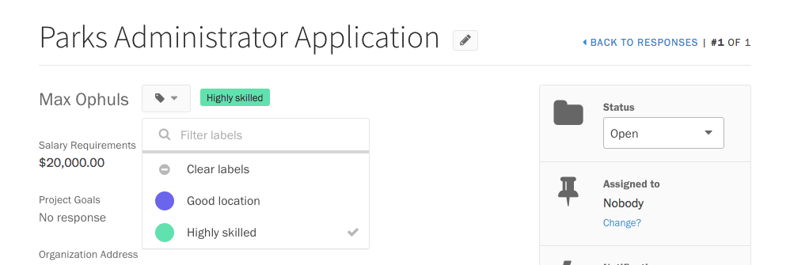

Labels are a great way to organize responses. You might feel more comfortable thinking about them as "tags." Responses can have multiple labels, and labels can be shared across responses.

### Adding and editing labels

From your project's Responses page, press the Plus button just above the list of labels to start adding a label.

Enter a name for your label, and choose a color if you'd like. Press the Add button to add your label.

After you create a label, you can always go back and edit them. Press the Edit button above the list of labels.

Edit and Delete buttons will appear next to each label. Press the Edit button to rename or change the color of a label, or press the Delete button to remove it. When you're done editing labels, press the Done button just above the list.

### Changing a response's labels

From your project's Responses page, select some responses using the checkboxes on the left side of the table. Press the "Label" button above the table, and select the labels you would like to add from the dropdown. You can assign as many labels as you want to a response.

If you want to remove a label from the responses you've selected, uncheck that label in the dropdown.

Click anywhere outside the dropdown to apply your changes. To speed up this process a bit, you can use the search bar at the top of the dropdown to find the exact label you're looking for.

You can also change a response's label while you are reading it. First, click on a response in the table to view it. Then, in the sidebar under "Labels," click "Change?" link and select the new labels from the dropdown.

