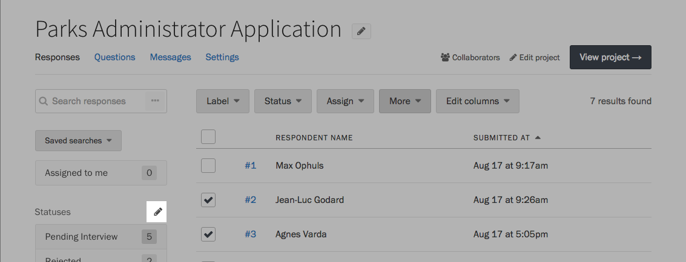
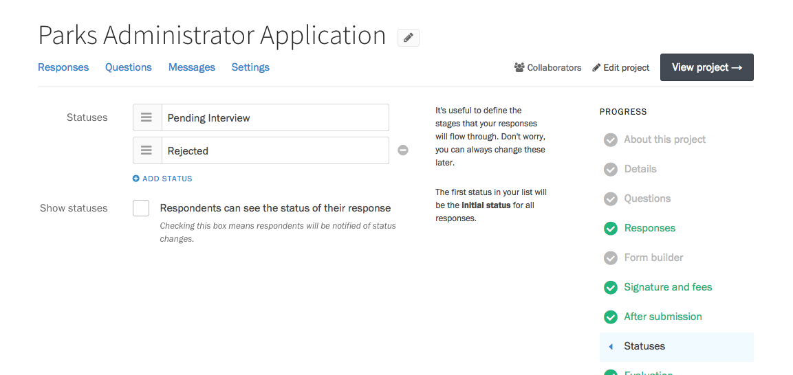
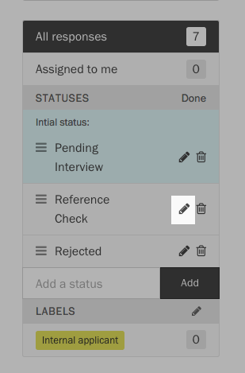
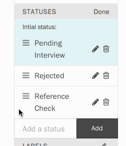
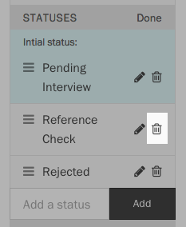
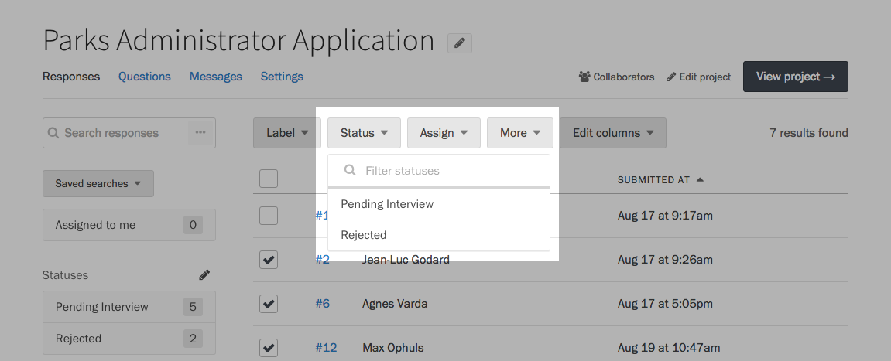
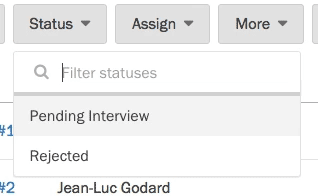
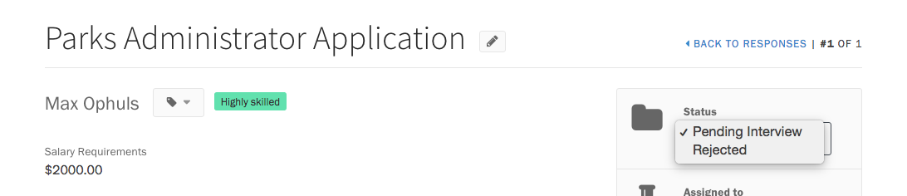

Statuses are a helpful way to organize responses and keep track of their current state. For example, a job application on Screendoor might have an "Incoming" status for newly received applications, an "Interview" status for those worth following up on, and a "Rejected" status for applications that didn't make the cut.

Most projects come with built-in statuses to give you a head start, but they can be customized for your specific needs.

### Adding and editing statuses

From your project's Responses page, press the Edit button to the right of the "Statuses" header.

To add a status, type its name in the "Add a status" field and press the Add button to save.

Press the Edit button to the right of a status to rename it. Be sure to press the Save button to save your changes.

To reorder the list, drag the icon on the left side of a status. The first status in the list will be treated as the default. It will be automatically applied to new responses.

Press the Delete button to the right of a status to remove it. Any responses which had that status will be reassigned to the first status in the list.

### Changing the status of a response

From your project's Responses page, select some responses using the checkboxes on the left side of the table. Press the Status button above the table, and select the new status from the dropdown. Click anywhere outside the dropdown to apply your changes.

To speed up this process a bit, you can use the search bar at the top of the dropdown to find the exact status you're looking for.

You can also change a response's status while you are reading it. First, click on a response in the table to view it. Then, in the sidebar, under "Status," select a new status from the dropdown.

---

## F.A.Q.

### Why can't I delete every status in my project?
All projects need to have at least one status that serves as the default. Feel free to rename your default status to whatever you would like.

### What's the difference between statuses and labels?
Responses can have multiple labels, but they can only have one status. For example, a response's _status_ could be either "Open" or "Closed," but it could be _labeled_ as both "Interesting" and "Practical."
