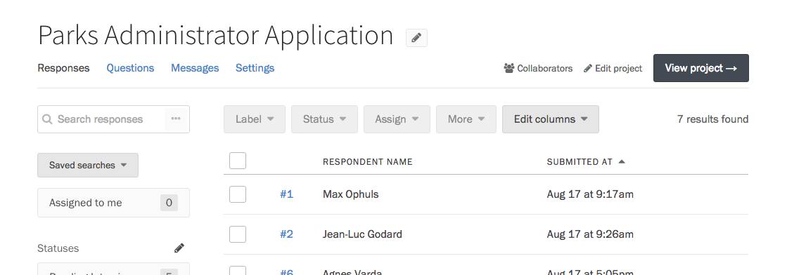
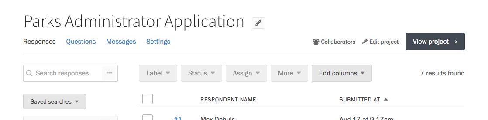
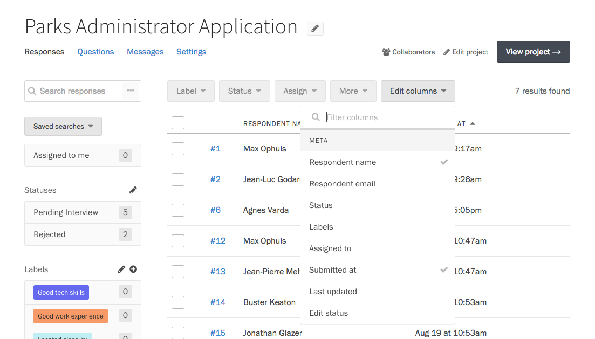
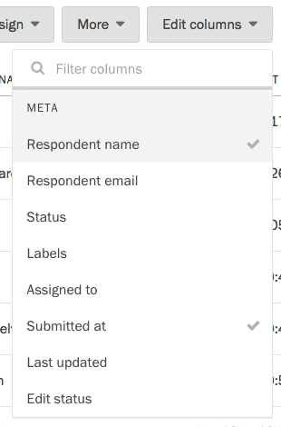

To view responses to your project, click the Responses link in the project header.

### Sorting responses

To sort the Responses table by a column in the table, just click on that column's header.

To reverse the sort order, click on the header again.

### Configuring the responses table

You can configure the table on the Responses page to display and sort by all kinds of information, including the response's status, assignee, labels, ratings, and answers to specific fields.

To configure the Responses table, press the "Edit columns" button above it. Select the information you would like to see in the table. Click anywhere outside the dropdown to apply your changes.

To speed up this process a bit, you can use the search bar at the top of the dropdown to find exactly what you're looking for.

