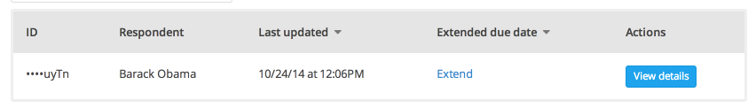

To see all unsubmitted responses for your project, navigate to the "Responses" page and click the "View unsubmitted responses" link underneath the statuses and labels section. Note that in order to preserve the privacy of your responders, you will only be able to view the status, not the actual content, of these unsubmitted responses. However, you can see how many validation errors have occurred so far and how many fields have been completed.

The goal of this page is to help you deal with any problems, issues, or questions that your responders may encounter while filling out your response form. If a responder needs help submitting their form, the "View unsubmitted responses" page will enable you to see what point they're at in the form and what they may need help with.