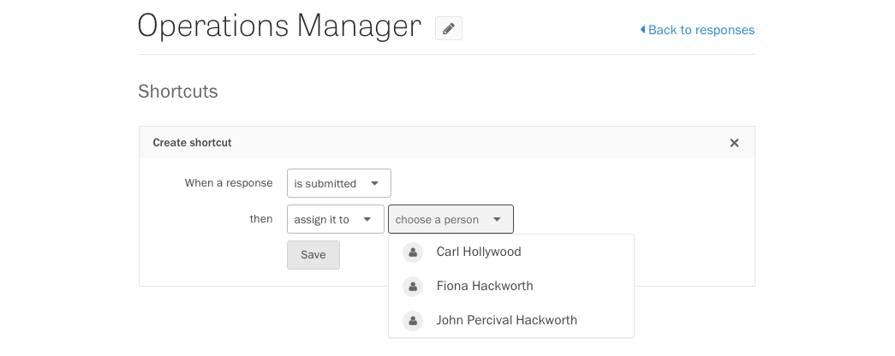

<iframe width="560" height="315" src="https://www.youtube.com/embed/E_uZAPVMsx4" frameborder="0" allowfullscreen></iframe>

Shortcuts are a foolproof way to automate the existing workflow behind your form. By performing routine, mundane tasks for you, shortcuts can help your team focus on what matters—evaluating responses, following up with respondents, and making smarter decisions, backed by data.

### Creating a shortcut

Go to your project's Responses page and click the Configure Shortcuts link in the lower left-hand corner.

Press the Add Shortcut button to configure your first shortcut.

Select your options from the dropdown menus to trigger an action when a response is submitted, revised, or rated, or when its status or labels are changed.

Press the Add Shortcut button to create additional shortcuts.

### Editing and deleting shortcuts

Edit and Delete buttons appear next to each shortcut. Press the Edit button to change the settings of a shortcut. When you're done configuring the shortcut, press the Save button to save your changes.

Press the Delete button to remove a shortcut.

### Reversing a shortcut

Whenever you trigger a shortcut, a notification appears on the lower right-hand corner of the page. To reverse the shortcut action, click the Undo link.

All actions related to shortcuts, even those that are reversed, are recorded in the activity feed.

### Understanding a shortcut

When a shortcut has been activated, collaborators with the appropriate permissions can see the shortcut's settings by clicking the View Shortcuts link in the notification.

