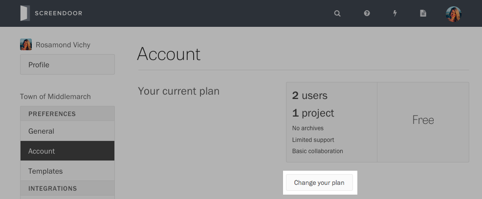
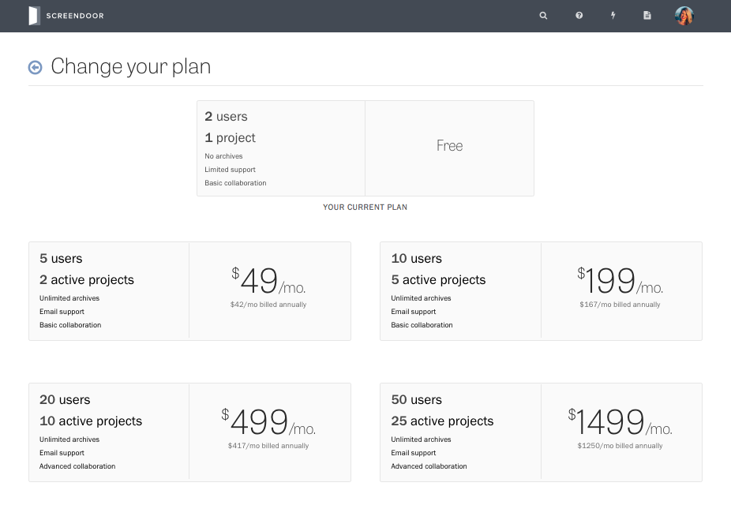
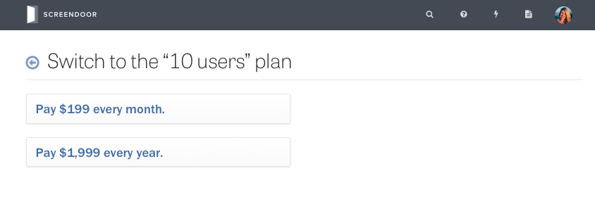
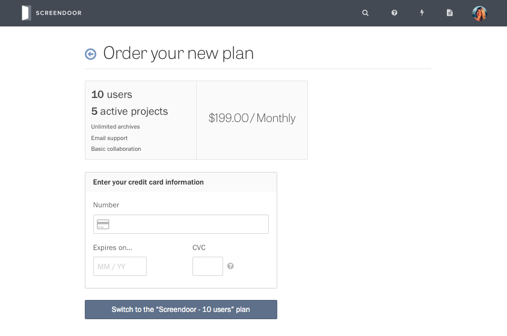
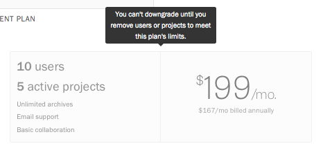
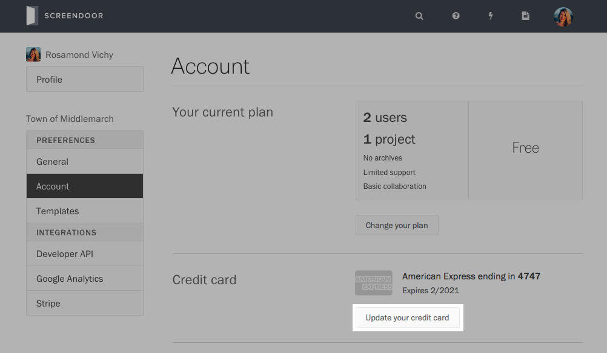

### Upgrading to a paid plan

At the top of the ["Account" page](https://screendoor.dobt.co/account/), you can find information about your current plan. To upgrade to a paid plan, press "Change your plan."

You can also navigate to this page by clicking on your avatar and selecting "Upgrade to a paid plan" from the dropdown.

Then, select the plan you would like to purchase.

On the next page, choose whether you would like to pay on a monthly or yearly basis.

Finally, enter your credit card information and press "Switch to the [new] plan."

### Switching to a different plan

At any time, you can switch plans from the ["Change your plan" page](https://screendoor.dobt.co/billing).

If you would like to downgrade your plan, we'll ask you to remove users or projects to meet the new plan's limits.

### Updating your credit card

On the ["Account" page](https://screendoor.dobt.co/account/), press the "Update your credit card" button under "Credit card." Enter your new credit card details and click the "Save" button.

