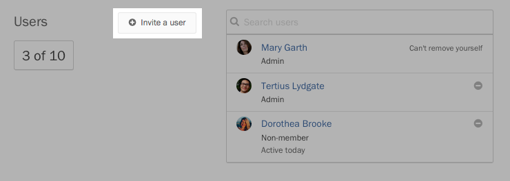
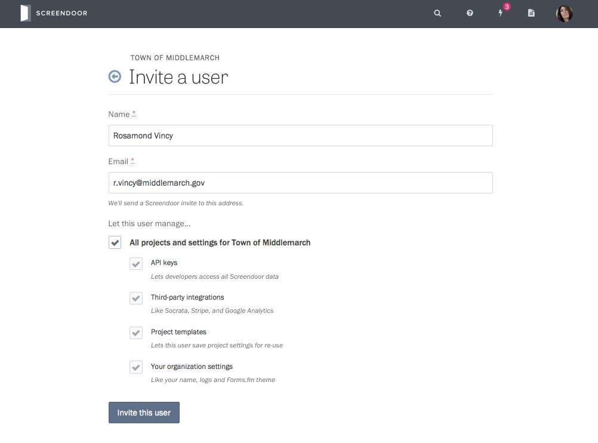
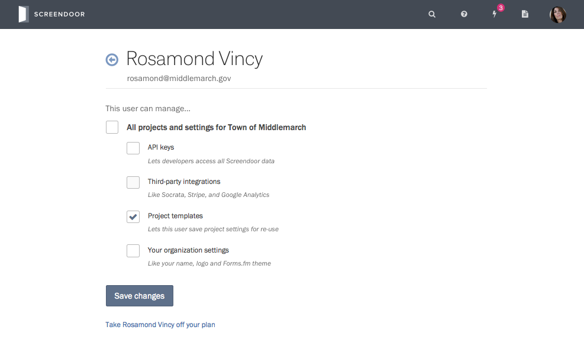
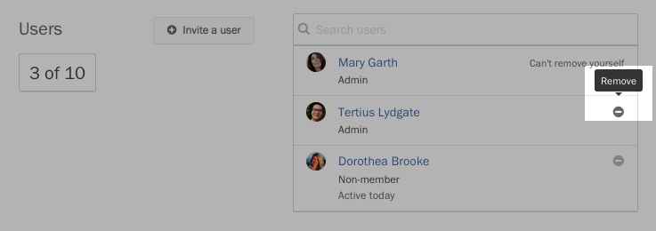
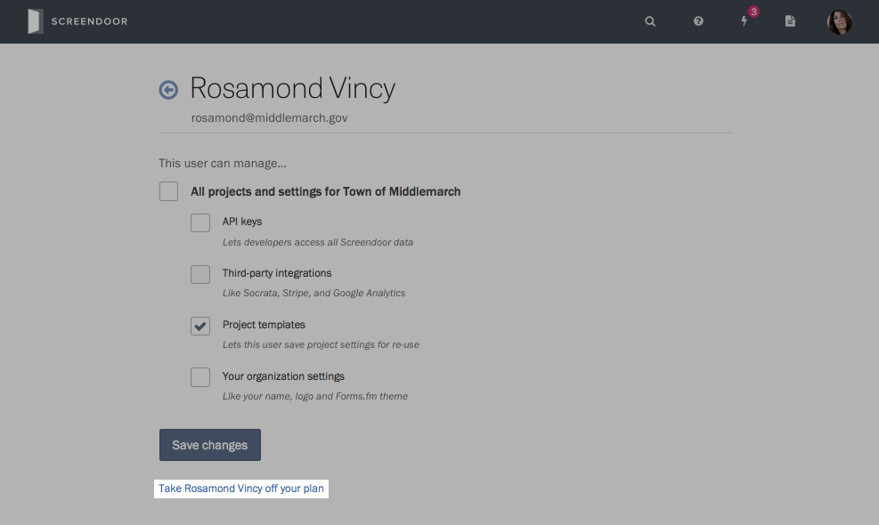

### Inviting new users

If you are an admin for your organization, you can add users from the ["Account" page](https://screendoor.dobt.co/account). Scroll down to the Users section, and press the "Invite a user" button.

On the next page, enter their name and email address, along with the permissions you would like them to have. The user you invited will receive a link to sign up for an account, after which they will be added to your organization.

### Managing user permissions

To edit the permissions of someone you have already invited, visit the ["Account" page](https://screendoor.dobt.co/account), and click on their name in the Users section. Once you change their permissions, press the "Save changes" button.

### Resetting a user's password

If you need to reset a user's password, have them [reset it themselves](sign_in.html#resetting-your-password). If they are still having trouble, tell them to email us at [support@dobt.co](mailto:support@dobt.co?subject=Reset password request).

### Removing a user from your account

On the ["Account" page](https://screendoor.dobt.co/account), scroll to the Users section, and click the Remove icon next to that user's name. Then, confirm your choice in the modal dialog that appears.

    **Note:** When you remove a user from your account, they will no longer have access to any projects they collaborate on, and the owner of your organization will administer any projects they owned.

You can also remove users while editing them. Click on the user's name, and then click "Take [this user] off your plan" at the bottom of the next page. Finally, confirm you want to delete the user in the modal dialog that appears.

