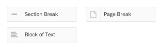
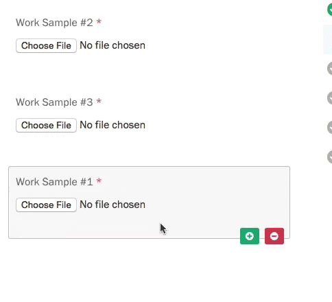
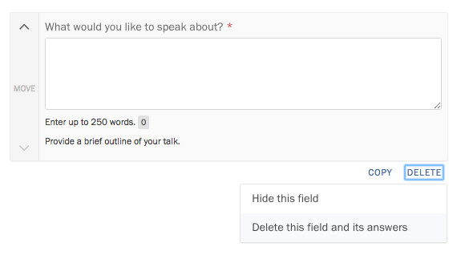
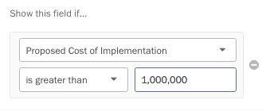
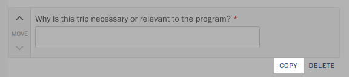
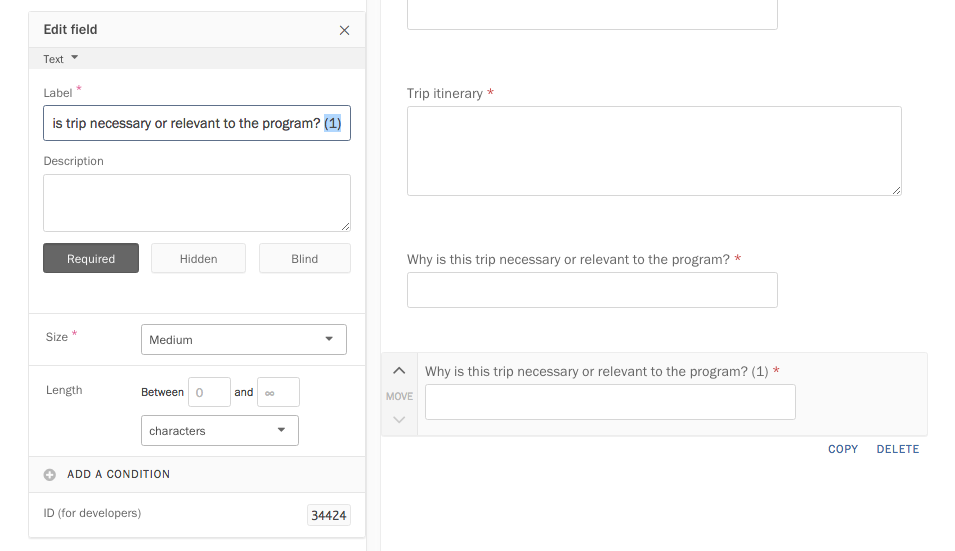
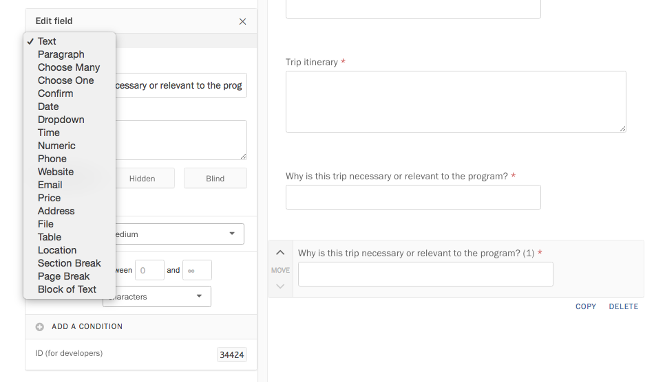
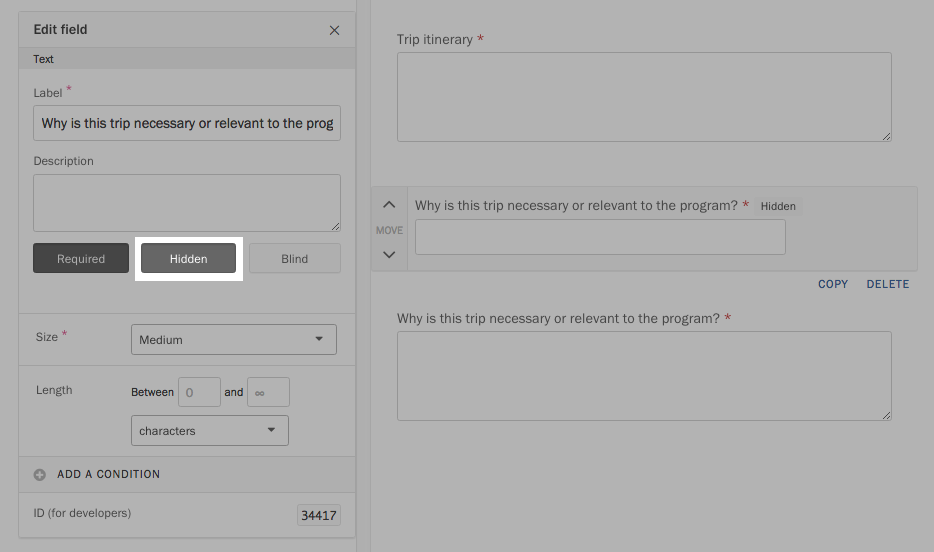

At the heart of every Screendoor project lies a form. Here's how to build your own.

    **Note:** Screendoor's form builder does not currently support smartphones, tablets, or other touch-based devices.

### Getting started

Select the &ldquo;Edit&rdquo; link on the right side of your project's header, and click &ldquo;The Form&rdquo; in the project wizard.

The left pane contains an array of buttons, each for a different type of field. You can add basic text boxes, checkboxes, radio buttons, dropdowns, and number inputs. Screendoor also gives you special fields with custom error validation, like dates, prices, emails and addresses. The right pane of the form builder displays a preview of how your finished form will look.

Click on a button in the left pane to add that field to your form. If you want to place the new field in a specific section of the form, you can also drag the button into the preview pane on the right.

The left pane will change to Edit mode, where you can fill out the details for that field.

To add another field, press the &ldquo;Add a new field&rdquo; button on the upper right-hand side of the Edit pane.

If you want to add a field that's similar to an existing field in your form, you can also copy fields. Hover over the field you want to copy, and click the "Copy" link in the lower right corner.

In addition to form fields, Screendoor lets you add blocks of text, section breaks, and page breaks. Press or drag a button in the &ldquo;Non-Input&rdquo; section of the left pane to add formatting.

### Editing a field

To edit a field in your form, click on it in the preview pane, and edit its details inside the left pane.

Like all edits to your project, your changes are saved automatically.

To reorder a field in your form, drag that field in the preview pane to its desired position or press the up or down buttons on the left side of the field.

### Deleting a field

To delete a field in your form, hover over the field you want to delete, and click the &ldquo;Delete&rdquo; link in the lower right corner.

If responses have been submitted to your project, we assume that those responses might contain answers to that field. In this case, clicking the &ldquo;Delete&rdquo; link will show a dropdown with two options: &ldquo;Hide this field&rdquo; or &ldquo;Delete this field and its answers.&rdquo;

Selecting &ldquo;Hide this field&rdquo; will make the field invisible to the public, move it to the bottom of the form, and leave your responses intact. If you select &ldquo;Delete this field and its answers,&rdquo; it will delete the field and remove all previous answers to it within your responses.

### Adding rules for complex logic

Rules allow you to add powerful logic to your form, by conditionally showing and hiding fields depending on the respondent's previous answers.

For example, if some questions in your form should be skipped unless the implementation cost is over $1 million, you could hide those fields until the respondent indicates their implementation cost. Let's walk through that example below.

To start adding rules, select the field you wish to hide, and press the &ldquo;Add a rule&rdquo; button in the left pane.

Under &ldquo;Only show this field if&hellip;&rdquo; select the appropriate options. In this example, we want to show this question only if the cost is more than $1 million.

Once you have set up your rule, you will see the label &ldquo;Hidden until rules are met&rdquo; next to the field in the preview pane. When the respondent fills out the form, they won't see this field unless they meet the rule.

If you want to show more than one field based on a previous answer, you must add the rule manually to each affected field.

    **Note:** Try to keep your form simple. If you find yourself creating complex conditional scenarios, or making forms with dozens of pages, consider breaking up your form into several smaller projects.

### Hidden and blind fields

You can make any field in your form _hidden_, which will make it visible only to your fellow reviewers, or _blind_, if you would like to hide personally identifying information during the evaluation process. [Learn more about hidden fields here](/articles/screendoor/evaluation/hidden_fields.html), or [read about blind fields here](/articles/screendoor/evaluation/removing_bias.html).

---

## F.A.Q.

### How do I change a field's type?

Because field type specifies what kind of data fields can store, it's not possible to change a field's type after you create it. You can, however, create a duplicate field with a different type:

First, duplicate the field by clicking the Copy link below it.

Remove &ldquo;(1)&rdquo; from the label of the new field.

Then, in the &ldquo;Edit field&rdquo; pane, select your desired field type.

Click on the original field. Under the description in the left pane, select the &ldquo;Hidden&rdquo; checkbox to hide that field from respondents. (Deleting a field entails deleting answers previously submitted to it, so setting the field to &ldquo;Hidden&rdquo; allows you to preserve existing data.)

