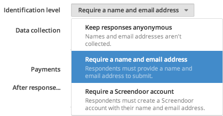
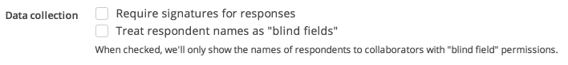
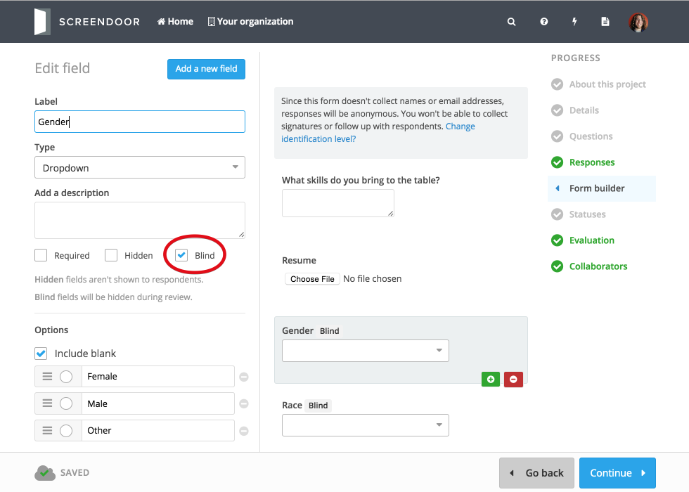
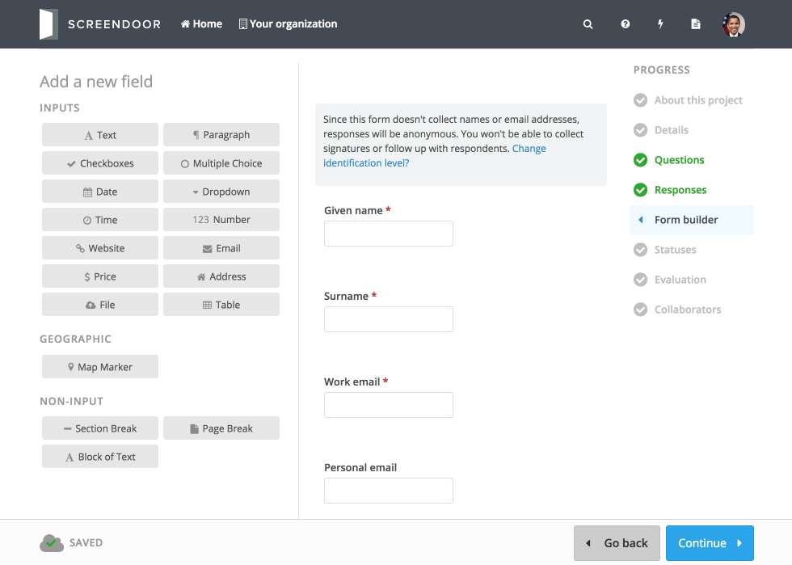
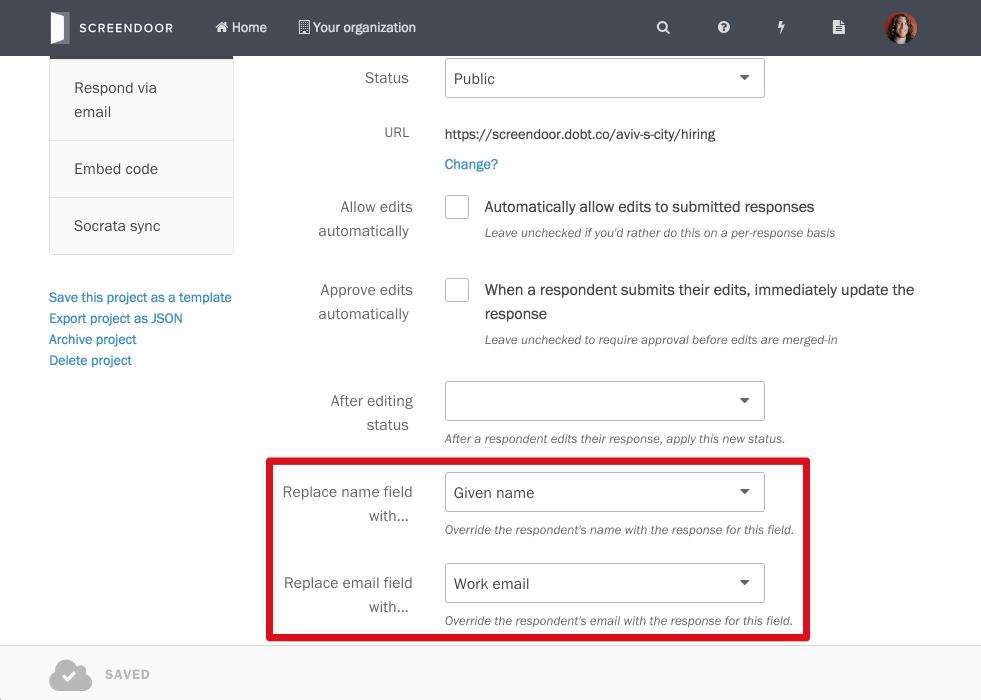

By default, Screendoor will collect names and email addresses from respondents. If a respondent is registered with Screendoor, their name and email address will automatically be collected based on their registration information. Otherwise, they'll be asked to enter this information manually.

If you'd like to require your respondents to create a Screendoor account before submitting responses, select "Require a Screendoor account" under "Identification level."

### Don't collect names and email addresses

If you don't want to collect names and email addresses from your respondents (or if you want to collect them via your own custom fields) select "Keep responses anonymous" under "Identification level."

To learn more about respondent identification, see the [Identification fields FAQ](identification_fields.html).

### Hiding respondent names

To stop your collaborators (other than those with "blind field" permissions) from viewing respondents' names, check the "Treat respondent names as 'blind fields'" box. This will allow you to collect respondents' names while keeping this information from your collaborators/reviewers.

## F.A.Q.

### Why does Screendoor collect names and emails by default?

Screendoor needs respondent names and email addresses in order to:

- Identify who submitted a response
- Send [messages](../messages/sending_messages.html) to respondents
- Require [signatures](signatures.html) from respondents

### Can I make responses anonymous?

Sure, just [set the identification level](response_preferences.html#don-t-collect-names-and-email-addresses) for your project to "Keep responses anonymous" and Screendoor will not collect names or email addresses from respondents. However, bear in mind that **keeping responses anonymous is appropriate only if you *never* want to identify or follow up with respondents**. If, on the other hand, you just don't want your reviewers to see respondent names or email addresses, you should [treat respondents names as "blind fields"](response_preferences.html#hiding-respondent-names) instead.

### What are blind fields?

Blind fields are fields that only admins can see. Because reviewers will not be able to view blind fields, they are a great way to keep the review process as unbiased as possible while still collecting information from respondents.

### Can I override the default name and email address fields?

Yes, though overriding Screendoor's default identification fields is only recommended for advanced users. To collect name and email address information in a different format:

1. [Set the identification level](response_preferences.html#don-t-collect-names-and-email-addresses) for your project to "Keep responses anonymous." This will disable Screendoor's default collection of names and email addresses.

2. Add your custom identification fields.

  

3. Set your project's identification fields to your new custom fields. This will enable Screendoor to identify responses and send messages based on these custom fields. Navigate to the "Settings" page for your project and click "Show advanced settings." Then, select your custom fields from the appropriate dropdown.

  
