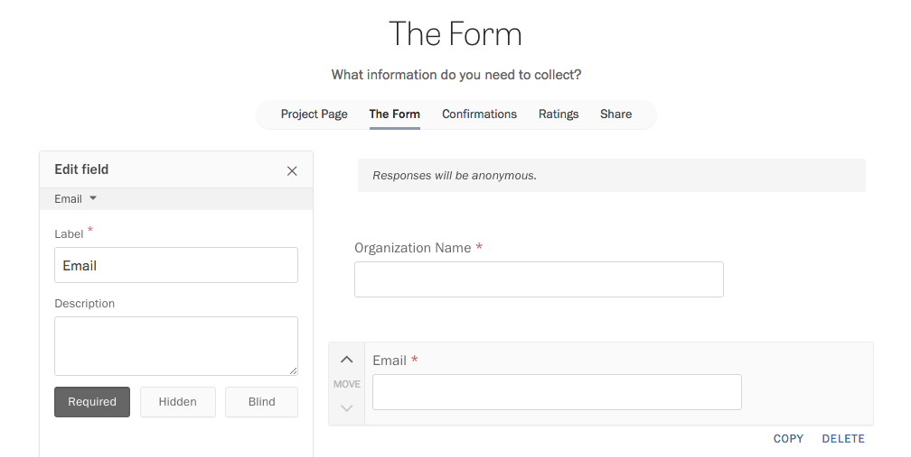

By default, Screendoor forms automatically collect names and email addresses from respondents, so you don't have to add those fields to the form yourself.

If you are creating a project where respondents might use your form frequently (such as for public records requests or data collection), they might be incentivized to create an account with Screendoor, so they can keep track of their responses. In this case, we'll use the name and email associated with their Screendoor account.

### Hiding names and email addresses from reviewers

To remove bias, Screendoor lets you use "blind fields" to hide personally identifying information from reviewers. [Read more about blind fields here.](/articles/screendoor/evaluation/removing_bias.html)

### Removing the name and email address fields

If you don't want to collect names or email addresses in your form, select the Name and Email fields in the form builder and click the "Remove" link.

Note that this setting will disable Screendoor features that require names and email addresses to work, such as [messages](/articles/screendoor/messages/sending_messages.html) and [e-signatures](/articles/screendoor/your_form/signatures.html). You can always add the name and email fields back to your form by clicking the "Restore name and email fields" link.

### Overriding the default fields for names and email addresses

If you want to change the labels of the name and email address fields, or you don't want them to be at the top of your form, Screendoor lets you replace the default name and email fields with other fields in your form.

To start, click the "Edit" link on the right side of the project header, and select "The Form" from the project wizard. Then, select the Name and Email fields and click "Remove."

Then, add your custom name and email fields, with the labels you wish. Make sure to add a Text field for the name, and an Email field for the email address. We strongly suggest that you make these fields required.

Navigate to your project's Settings page, and click "Show advanced settings." Then, select your custom fields from the dropdowns that appear.

---

## F.A.Q.

### How do I prevent respondents from submitting more than one response?

To limit submissions to one response per respondent, you must first require respondents to create or log in with an existing Screendoor account.

In the project header, click "Edit" and select "The Form" in the project wizard. Then, select the Name and Email fields in the form builder. In the "Edit field" pane, check "Require a Screendoor account to submit," and under that option, check "Only allow one response per respondent."

