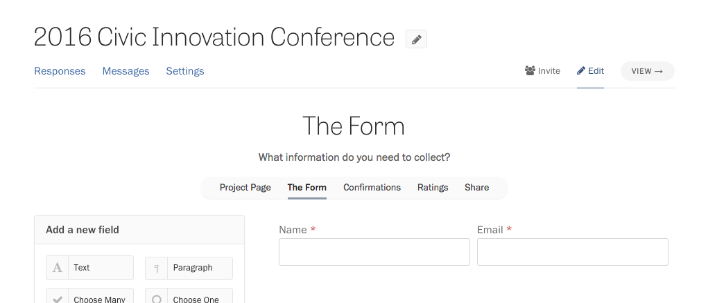

By default, Screendoor forms automatically collect names and email adddresses from respondents, so you don't have to add those fields to the form yourself.

If you are creating a project where respondents might use your form frequently (such as for public records requests or data collection), they might be incentivized to create an account with Screendoor, so they can keep track of their responses. In this case, we'll use the name and email associated with their Screendoor account.

### Hiding names and email addresses from reviewers

Screendoor lets you use &ldquo;blind fields&rdquo; hide personally identifying information from reviewers to remove bias. [Read more about blind fields here.](/articles/screendoor/evaluation/removing_bias.html)

### Removing the name and email address fields

If you don't want to collect names or email addresses in your form, select the &ldquo;Edit project&rdquo; link on the right side of the project header, and select &ldquo;Responses&rdquo; from the Progress menu. Under &ldquo;Identification level&rdquo;, select &ldquo;Keep responses anonymous&rdquo;.

Note that this setting will disable Screendoor features that require names and email addresses to work, such as [messages](/articles/screendoor/messages/sending_messages.html) and [e-signatures](/articles/screendoor/your_form/signatures.html). You can always add the name and email fields back to your form by changing this setting to &ldquo;Require a name and email address&rdqup;.

### Overriding the default name and email fields

If you want to change the labels of the name and email address fields, or don't want them to be at the top of your form, Screendoor lets you replace the default name and email fields with other fields in your form.

To start, visit the &ldquo;Edit project&rdquo; link on the right side of the project header, and select &ldquo;Responses&rdquo; from the Progress menu. Under &ldquo;Identification level&rdquo;, select &ldquo;Keep responses anonymous&rdquo;.

Select &ldquo;Form builder&rdquo; from the Progress menu, and add your custom name and email fields, with the labels you wish. Make sure to add a Text field for the name, and an Email field for the email address. We strongly suggest that you make these fields required.

Navigate to your project's Settings page, and click &ldquo;Show advanced settings&rdquo;. Select your custom fields from the dropdowns that appear.

