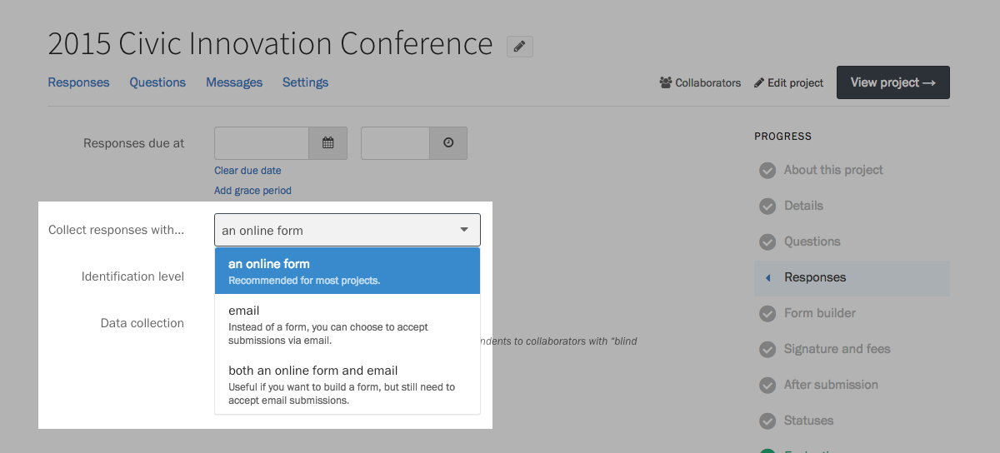

For simple projects, you might want to let respondents submit to your project through email. Think of it like a shared inbox for your team, with Screendoor's great evaluation features built right in.

### Getting started

Select the &ldquo;Edit project&rdquo; link on the right side of the project header, and choose &ldquo;Responses&rdquo; from the Progress menu. Under &ldquo;Collect responses with&hellip;&rdquo;, you can choose &ldquo;both an online form and email&rdquo; to add email responses, or &ldquo;email&rdquo; to remove the form from your project altogether.

    **Note:** If you choose to only accept email responses, you will not be able to add a submission fee or e-signatures to your project.

### Using a custom email address

By default, Screendoor gives your project an <code>@in.dobt.co</code> address to collect submissions. If you want to use a different email address, click the &ldquo;use a custom address&rdquo; link on the Responses page.

Enter your custom email address in the modal dialog that appears.

    **Note:** Don't use your personal email address to collect responses. Instead, set up a [email alias](https://en.wikipedia.org/wiki/Email_alias) that forwards all responses to your <code>@in.dobt.co</code> address.

### Using the Shared Inbox template

You can skip these initial setup steps by using our built-in Shared Inbox template. When you [create a project](/articles/screendoor/projects/creating_a_project.html), select &ldquo;Shared Inbox&rdquo; when you are asked to choose a project type.

