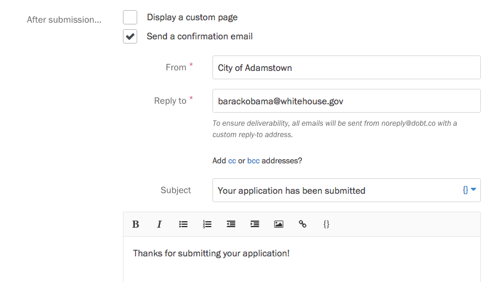

### Customizing your confirmation page

By default, Screendoor displays a nice confirmation page when their response has been successfully submitted:

If you'd like, you can customize the text of this page. Select the &ldquo;Edit project&rdquo; link on the right side of the project header, and choose &ldquo;After submission&rdquo; from the Progress menu. Under &ldquo;After submission&hellip;&rdquo;, check the box &ldquo;Display a custom page&rdquo;.

Write up your custom confirmation page in the text box that appears.

### Sending a confirmation email

To send a confirmation email to respondents after they submit their response, check the box &ldquo;Send a confirmation email&rdquo; box on the &ldquo;After submission&rdquo; page.

Write your confirmation email inside the form that appears.
