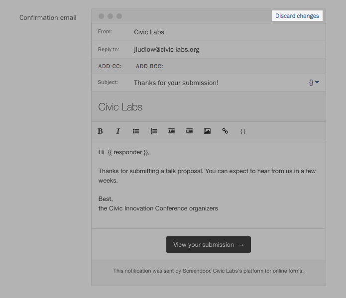

### Customizing the success message

By default, Screendoor displays a nice confirmation page when a response has been successfully submitted:

You can customize the message that appears on this page. Select the &ldquo;Edit&rdquo; link on the right side of the project header, and click the &ldquo;Confirmations&rdquo; tab from the project wizard. Then, click the &ldquo;Edit&rdquo; link at the top-right corner of the success message preview.

Write your custom message in the text box that appears.

To revert back to the default success message, click the &ldquo;Discard changes&rdquo; link.  

### Customizing the confirmation email

Screendoor sends a default confirmation email to respondents after they submit their response. To customize this email, select the &ldquo;Edit&rdquo; link on the right side of the project header, and click the “Confirmations” tab from the project wizard. Then, select the option &ldquo;Send a confirmation email and show a success message.&rdquo;

Under Confirmation email, click the &ldquo;Edit&rdquo; link at the top-right corner of the message preview.

Write your custom message in the text box that appears. You can also change the reply-to email address and add &ldquo;CC&rdquo; and &ldquo;BCC &rdquo; fields.

To revert back to the default confirmation email, click the &ldquo;Discard changes&rdquo; link.  

