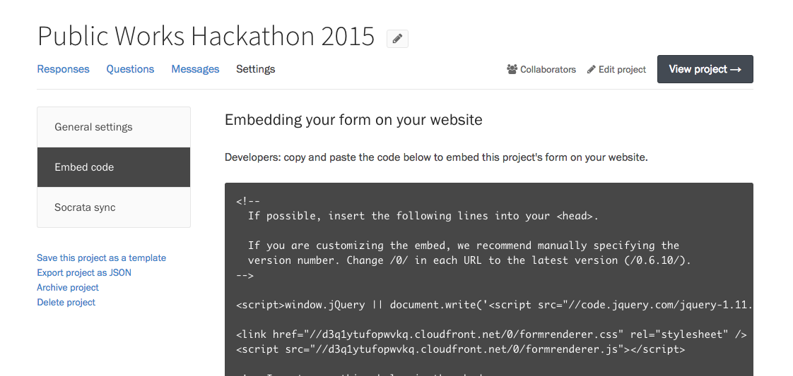

Screendoor comes with beautiful, customizable forms with your own custom color scheme, logo, and subdomain. But you might want your form to be more integrated with your existing website. Screendoor's embed code lets you place your form inside any webpage, and match that page's look and feel.

### Getting started

From your project's Settings page, and select &ldquo;Embed code&rdquo; in the sidebar. Copy the embed code you seeinto your own website or CMS to embed your form.

### Example

Here is an example of a simple embedded form, from a live Screendoor project.

<form class="embed_example" data-formrenderer></form>

### Customizing your embedded form

Developers can customize our embed form in a few different ways. [Check out our Github repository](https://github.com/dobtco/formrenderer-base) to learn more.

---

## F.A.Q.

### Why can't I embed projects with signatures or fees?

Unfortunately, [fees](payments.html) and [signatures](signatures.html) are not supported in embedded forms at this time.

### I see a "Project not found" error when I try to embed my form. Help!

This error usually occurs when your [project is not yet public](/articles/screendoor/projects/going_public.html). Only projects with a status of &ldquo;Unlisted&rdquo; or &ldquo;Public&rdquo; can be embedded.
