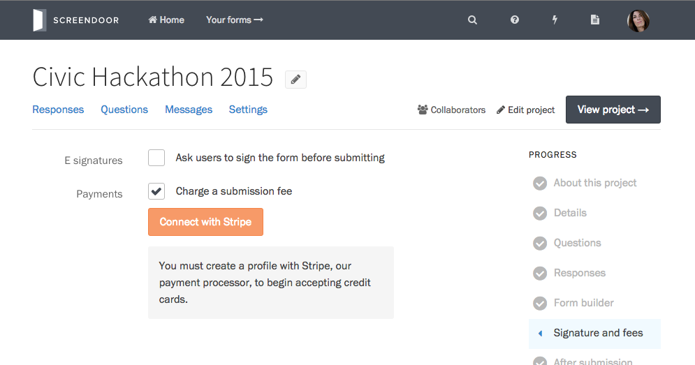
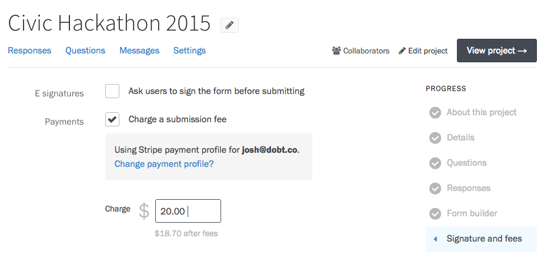

Screendoor lets you charge submission fees for your projects by allowing you to easily receive credit card payments via [Stripe](https://stripe.com/). After you create a Stripe account, connect it to Screendoor, and set the fee amount for your project, respondents will be asked for payment before submitting their response.

    **Note:** You must be an administrator, or have the appropriate [permissions](/articles/your_account/dashboard/managing_users.html#managing-user-permissions), to manage payments for your organization.

### Getting started

To accept credit card payments, you will first need to [create a Stripe account](https://dashboard.stripe.com/register).

When you have a Stripe account, select the &ldquo;Edit&rdquo; link on the right side of the project header, and choose &ldquo;Details&rdquo; from the Progress menu. Under &ldquo;Payments&rdquo; check the box &ldquo;Charge a submission fee.&rdquo;

Press the &ldquo;Connect with Stripe&rdquo; button to connect to your Stripe account. You will be redirected to Stripe's website. Complete the form and press the &ldquo;Authorize access to this account&rdquo; button to return to Screendoor.

    **Note:** Payment profiles are shared across all projects in your organization, so you will only need to complete this process once.

Once you have connected to Stripe, enter the amount you would like the respondent to pay.

Under the fee amount, Screendoor shows you the percentage you will receive after Stripe's and Screendoor's transaction fees.

### Switching Stripe accounts

To use a different Stripe account, click the &ldquo;Change profile&rdquo; link from the &ldquo;Signature and fees&ldquo; page.

You can then press the &ldquo;Connect with Stripe&rdquo; button to connect to a different Stripe account.

### Viewing completed charges

To view completed payments, click your avatar in the navigation bar, select &ldquo;Settings&rdquo; in the dropdown, and then select &ldquo;Payment profile&rdquo; in the sidebar.

You can also switch Stripe accounts for your organization from this page.

To view a completed charge inside of Stripe, press the &ldquo;View on Stripe&rdquo; button.

---

## F.A.Q.

### Will respondents need a Stripe account in order to pay?
All they'll need is a valid credit card. No account necessary!

### Can I waive payment for specific respondents?
Yes, you can waive payment for a specific response from the [unsubmitted responses](../responses/providing_support_to_respondents.html#waiving-payment-for-a-draft) page.

### Are there processing fees?
Yes: 5% + 30&cent; per transaction. Stripe [charges](https://stripe.com/us/pricing) 2.9% plus 30&cent;, and Screendoor charges an additional 2.1%.
