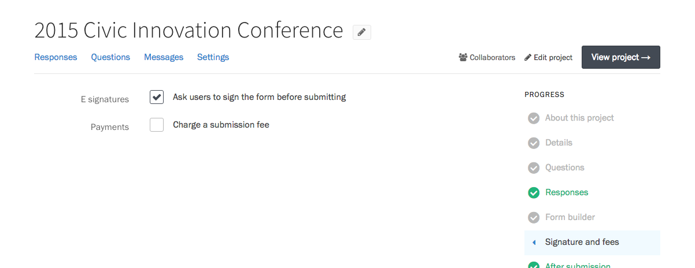
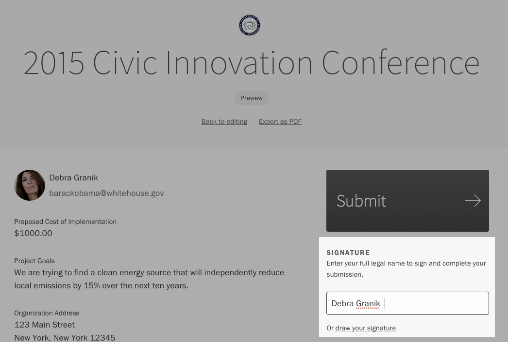
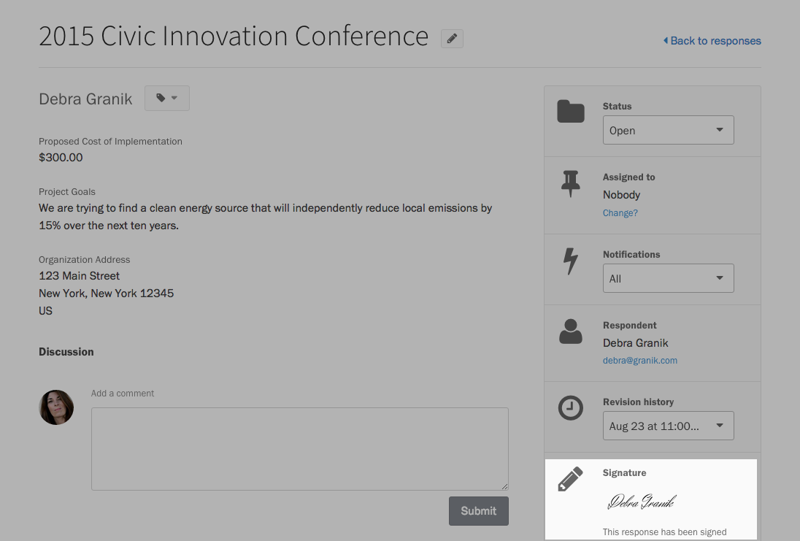
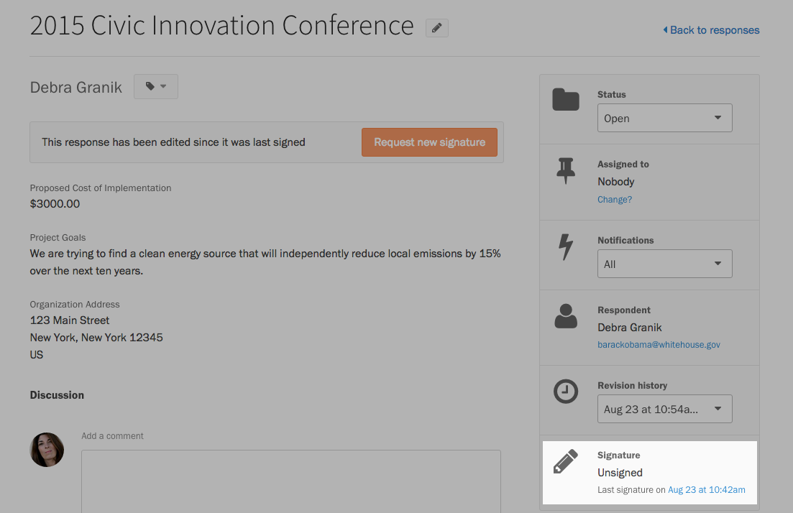
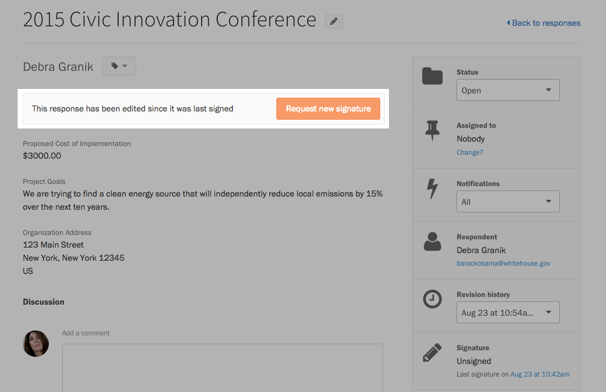
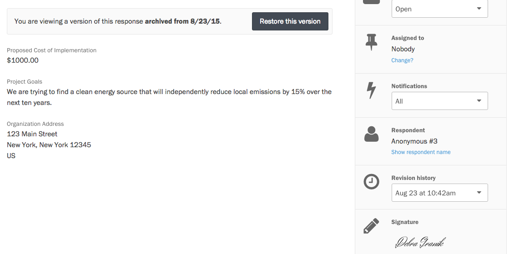
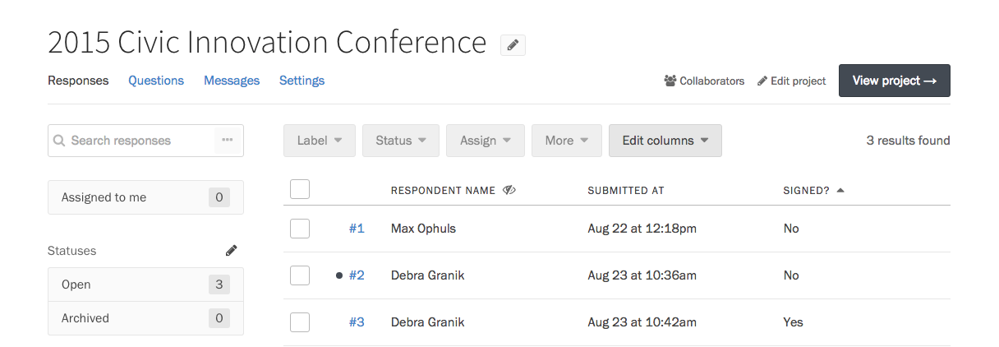

If you need your forms to be signed before they are submitted, Screendoor lets you add electronic signatures to any form.

    **Note**: In order to use electronic signatures, you'll need to sign up for a Plus plan or higher.

### Getting started

Select the &ldquo;Edit project&rdquo; link on the right side of the project header, and choose &ldquo;Signature and fees&rdquo; from the Progress menu.  

To add electronic signatures to your project, check the box &ldquo;Ask users to sign the form before submitting&rdquo;.

When respondents fill out your form, they will now be asked to sign their response before submitting it.

That's it! Respondents will now be required to sign their response before submitting it.

### Viewing a signature

When a response is signed, you can view their signature from that response's page. Go to your project's Responses page, and click on a response in the table. The signature should be displayed in the sidebar on the right-hand side.

### Requesting a new signature

Screendoor binds each signature to a single revision of a response. If you, the respondent, or a collaborator edits a response, it will need to be signed again.

When a response is edited, the signature status in the sidebar changes accordingly.

To send an email asking the respondent to sign the new revision, click the &ldquo;Request new signature&rdquo; link.

After they sign the response, the new signature will display in the sidebar. You can still view their old signatures by viewing a previous revision of the response.

To quickly view which responses in your project still need signature, press the &ldquo;Edit columns&rdquo; button on the Responses page, and display the &ldquo;Signed?&ldquo; column.

Click on the column's header to sort unsigned responses at the top of the table.
