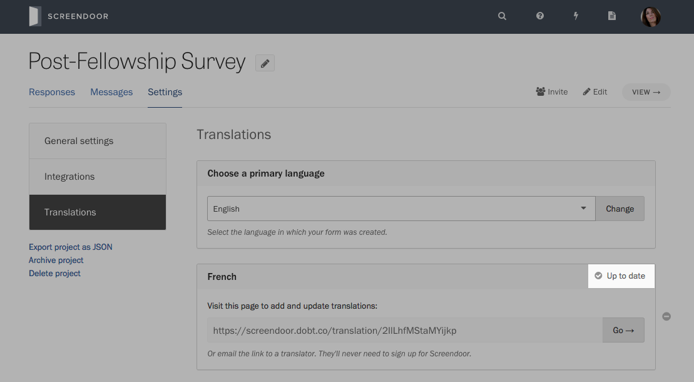
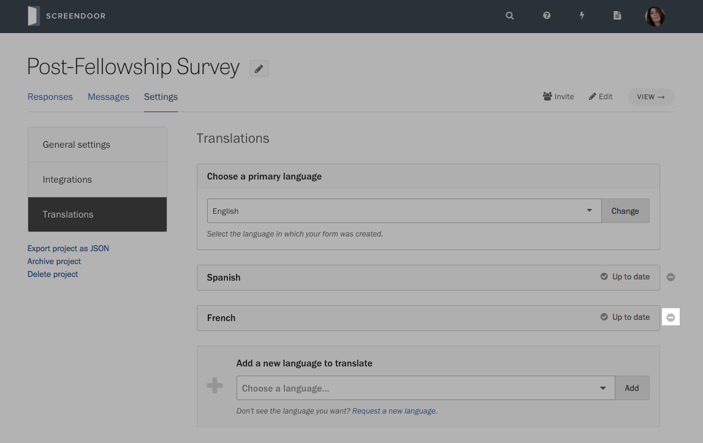
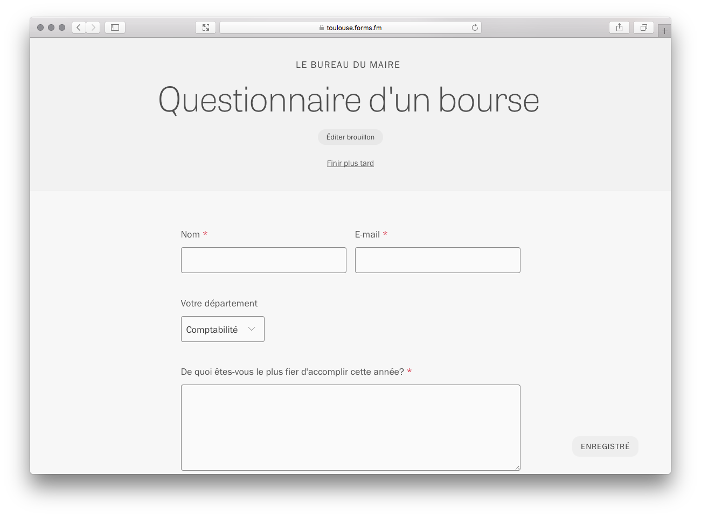
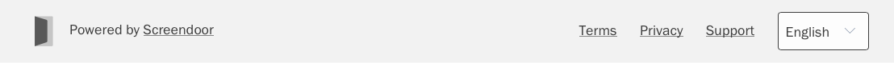

    **Note:** Screendoor currently supports forms in Spanish, French, Italian, and German. Email us at [support@dobt.co](mailto:support@dobt.co) if you’d like to request a new language.

### Adding translations

Visit your project’s Settings page and select "Translations" from the sidebar.

If you did not build your form in English, choose the language you used from the “Choose a primary language” dropdown and press “Change.”

Under "Add a new language to translate," select the language you would like to translate your form into and press “Add.”

A translation module for this language will appear.

Press “Go&rarr;” to visit the page to add your translation. Alternatively, you could email the URL to a translator. (They do not need to sign up for Screendoor to access this page.)

Follow the steps on the translation page:

When the translated spreadsheet upload is complete, a success message will appear in the lower-right corner of the page.

You can also return to the "Translations" settings page to confirm that your translations for this language are now up to date.

### Updating translations

If you modify your project page or form, Screendoor will let you know whether your translations are out of date. On the "Translations" settings page, you can find the number of missing translations next to each language you've added to your project.

To update your translations, press “Go→” to visit the page to update your translations. You'll follow the same steps you took to [add your initial translations](#adding-a-translation).

### Removing translations

On the “Translations” settings page, press the delete icon next to the language you would like to remove from your project.

### Viewing a translated form

When a respondent visits your form on Forms.fm, it will appear in the language of their choice (as determined by their browser's language preferences).

Respondents can also manually change the language of a Forms.fm form by selecting their desired language from the dropdown at the bottom of the page.

---

## F.A.Q.

### Can I translate a project with a questions page?

Questions pages aren't available in translated projects.

### Can I notify respondents of status changes in a translated project?

Since status cannot be translated, we do not support automatic of status change notification in translated projects.

### Can I embed a translated project?

Yes! To enable translations in an embedded form, you'll need to set the [`responderLanguage`](https://github.com/dobtco/formrenderer-base#customization-options) parameter in [your embed code](./embedding_your_form.html).
