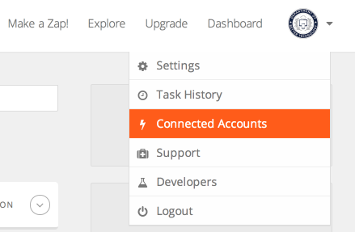
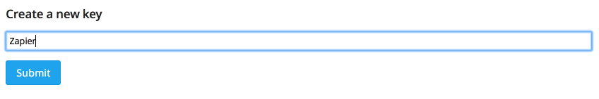
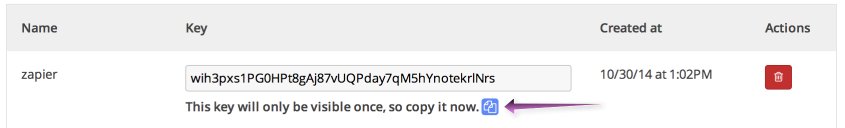
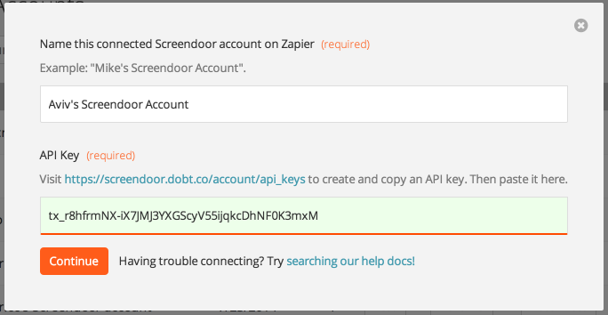

To get Screendoor working with Zapier, the first thing you'll need to do is connect your Screendoor account. Select "Connected Accounts" from the Zapier menu to get started.

Click "Connect new account" and select "Screendoor."

Next, enter a name for your Screendoor account (this is just for your own reference, so call it whatever you want).

To connect your Screendoor account, you'll need to [create an API key from Screendoor](https://screendoor.dobt.co/account/api_keys). Enter an API key name (again, whatever you'd like), and click "Submit" to create your Screendoor API key.

After you create your key, copy it by clicking the blue "Copy to clipboard" icon.

Paste this API key into Zapier and click "Continue."

Zapier will test your API key to make sure it's working. If you get an authorization error at this point, make sure you've entered your API key correctly.

That's it! Your Screendoor account is now connected to Zapier, which means you can use Screendoor triggers in your zaps.
