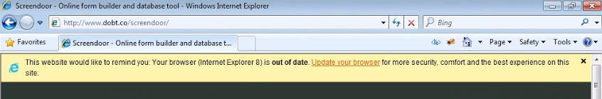

DOBT's applications are designed to support the latest web browsers. We recommend using Google Chrome. It is fast and automatically keeps itself up to date. We also support the current versions of Safari, Firefox, and IE 9+. Please note that IE9 may not support all of our features, and users are encouraged to upgrade to at least version 10.

If you see the following warning, you'll need to upgrade your web browser before our apps function as intended:

