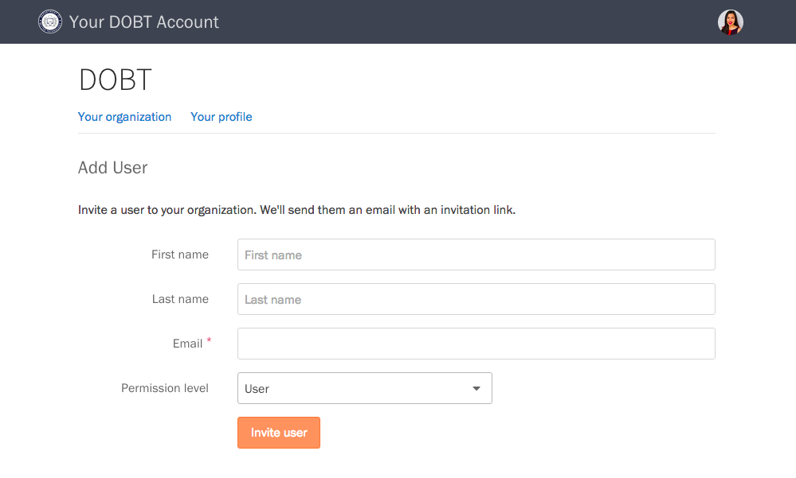

## Inviting new users

If you are an administrator in your organization, you can add users from the ["Your organization" page](https://dashboard.dobt.co/organization/). Scroll down to the "Users" section, and click the "Add user" button. 

Fill out the form, click the "Invite user" button, and we'll send them an invitation link.

## Managing user permissions

When you add a user, you can choose the appropriate permission level for that user from the "Permission level" dropdown on the "Add User" page.

To manage permissions for an existing user, select the user from the ["Your organization" page](https://dashboard.dobt.co/organization/). Then, choose a permission level from the "Permission level" dropdown. For app-specific permissions, select the appropriate permissions under "App permissions."

## Resetting a user's password

Point the user to the [Signing in](./signup_and_login.html) article, or have them email us at [support@dobt.co](mailto:support@dobt.co?subject=Reset password request).

## Removing users

On the "Your organiztion" page, click on the user you'd like to remove. You will be directed to the user's page where you can click the "Remove from staff" link at the bottom of the page. You will be prompted to confirm that you want to remove that user.
