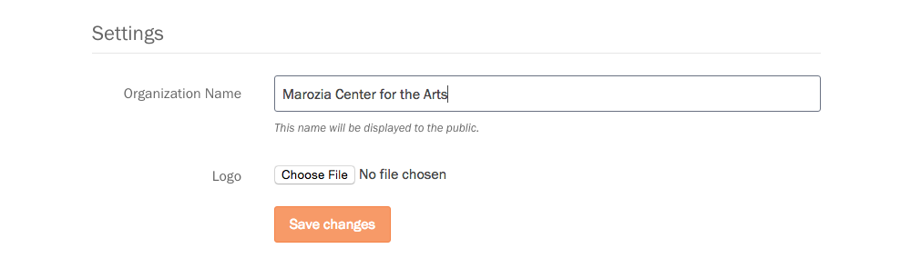

## Your organization details

To configure or update your organization details, navigate to the "Settings" section of the Dashboard. If you are an administrator in your organization, you'll be able to edit your organization's name, logo, and timezone from this page.

To configure your organization's name, simply edit the text field. To configure the logo, click the "Select image" button and choose a logo from you computer to upload. To change the timezone for your organization, select the appropriate timezone from the "Timezone" dropdown. Click the "Update Organization" button to save your changes.
