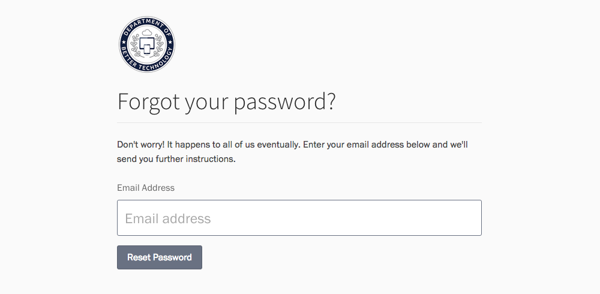

## Signing up

### From an existing organization

If you don't already have a DOBT account, you'll need to ask an administrator from your organization to invite you. Once they do, you'll be able to create an account by accepting the invite and filling out the basic form.

### With a new organization

If you aren't part of an existing organization, you'll need to [sign up as a new organization](https://dashboard.dobt.co/organizations/new).

## Signing in

If you already have a dobt.co account, you can sign in from the [sign in page](https://dashboard.dobt.co/sign_in). You'll need the email address you signed up with, as well as the password you created.

## Forgot password

If you forgot your password, simply click the "Forgot your password?" link. Then, follow the prompts to reset your password.

## Enabling two-factor authentication

Two-factor authentication provides enhanced security by requiring an extra step for authentication.

See the [Two-factor authentication](two_factor_auth.html) article for details.

---

## F.A.Q.

### My password isn't working

If your password isn't working, make sure that you're signing in with the correct email address and double check that caps lock is off. If it still isn't working, click the "Forgot your password" link to reset your password.

### I'm having trouble resetting my password

If you tried to reset your password but still have not received the reset email, confirm that you sent it to the correct email address and that it didn't get caught in a spam filter. If you still haven't received the reset email after some time has passed, try contacting an administrator from your organization. If you still can't sign in and cannot resolve the issue, [contact us](mailto:support@dobt.co).
