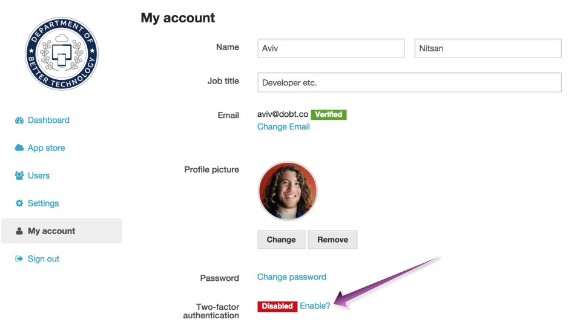
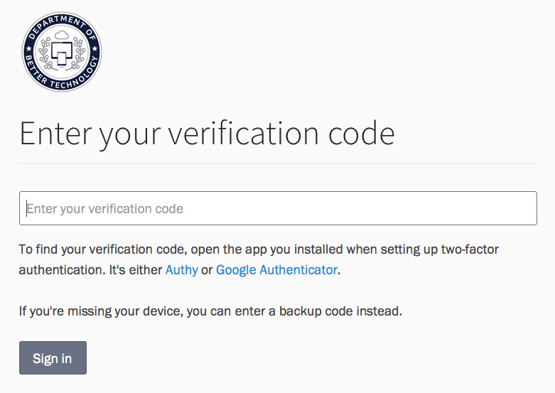

Make your account more secure by requiring an extra step for authentication. If you have a smartphone, you'll need either the [Authy](https://www.authy.com/) or [Google Authenticator](https://support.google.com/accounts/answer/1066447?hl=en) mobile app. If you don't have a smartphone, you can use the [Authy Chrome app](https://chrome.google.com/webstore/detail/authy/gaedmjdfmmahhbjefcbgaolhhanlaolb).

## Enabling two-factor authentication

To enable two-factor authentication for your DOBT account, go to the "My account" tab on the DOBT Dashboard. Under "Two-factor authentication," click the "Enable?" link.

### Using the Google Authenticator app

To use the Google Authenticator app for two-factor authentication from your smartphone, download the Google Authenticator app. Then, simply open Google Authenticator from your phone, press the "+" button, and select "Scan barcode." Scan the QR code from the DOBT Dashboard, enter the validation code from Google Authenticator into the DOBT Dashboard, and click the "Verify device" button.

### Using the Authy smartphone app

To use Authy for two-factor authentication from your smartphone, download the Authy app. When your first launch it, you'll have to enter your phone number and email address. Verify your account by sending an SMS and then entering the registration code from that SMS into Authy.

Next, add an "authenticator account" by pressing the plus button. Scan the QR code displayed on the DOBT Dashboard (or enter the code manually), enter "DOBT" as your account name, and press "Done." Next, enter the validation code from Authy into the DOBT Dashboard and click "Verify device." You should now see the "You've enabled two-factor authentication!" page. Make sure you write down your backup codes, so you can access your account if you lose your phone.

### Using the Authy Chrome app

The easiest way to use two-factor authentication without a smartphone is with the Authy Chrome app.

[Download the Authy Chrome app](https://chrome.google.com/webstore/detail/authy/gaedmjdfmmahhbjefcbgaolhhanlaolb) and set it up by entering your phone number. Then, verify your phone number by sending an SMS and then entering the registration code from that SMS into Authy.

Next, set up a master password for Authy under the "Account" tab.

Now that your Authy account is set up, click "Add Authenticator Account" and enter the code displayed under step 2 from the DOBT Dashboard (it will be something like `xrijdtj44fdc26tdopxpg6yt`). Click "Add Account," select a logo, and enter "DOBT" for the account name. You should now see a "DOBT" account under "External Accounts" in Authy.

To finish setting up two-factor authentication for your DOBT account, close the main Authy window. You should then see a smaller Authy window: click "DOBT" and then "Copy" to copy your validation code. Enter that code into the DOBT Dashboard and click "Verify device." You should now see the "You've enabled two-factor authentication!" page. Make sure you write down your backup codes so you can access your account if you lose your phone.

## Saving your backup codes

If you don't have access to your cell phone, **you won't be able to sign in to your account unless you have your backup codes**. It is very important to write these codes down somewhere safe or store them in an encrypted file on your computer.

## Signing in with two-factor authentication enabled

To sign in to your DOBT account with two-factor authentication enabled, enter your email and password as you normally would.

- *If you're using the Google Authenticator app*:  
Open Google Authenticator on your smartphone and note the DOBT verification code.

- *If you're using the Authy smartphone app*:  
Open Authy on your smartphone, press "DOBT," and note your verification code.

- *If you're using the Authy Chrome app*:  
Open Authy, enter your master password, click "DOBT," and copy your verification code.

Next, enter that verification code into the DOBT Dashboard page and click "Sign in."

