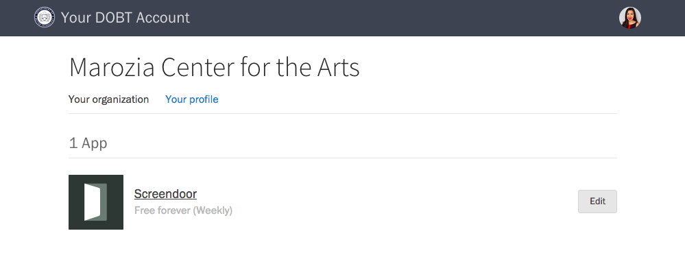

## Launching an application

Go to the ["Your organization" page](https://dashboard.dobt.co/organization/) and click the name of the application you would like to launch.

## Changing the URL or slug of an application

To change an application's URL (slug), click the "Edit" button to the right of the application on the ["Your organization" page](https://dashboard.dobt.co/organization/). Enter a new slug, and then click the "Save changes" button. Note that your slug must be unique. If your slug is already taken by another organization, we'll ask you to choose another.

## Adding or changing your plan

On the ["Your organization" page](https://dashboard.dobt.co/organization/), click the "Edit" button to the right of the application. Under "Plan," select a plan from the dropdown and click the "Save changes" button. (If you don't have a credit card on file with us, you will see an "Enter payment information" button instead.) See the [Billing](../accounts/billing.html) article for more information on billing and subscription.

If you're on a custom plan and would like to change it, please contact us at [hello@dobt.co](mailto:hello@dobt.co).

## Removing an application

From the "Your organization" page, click the "Edit" button to the right of application's name. Click the "Uninstall app" link to remove the application.
