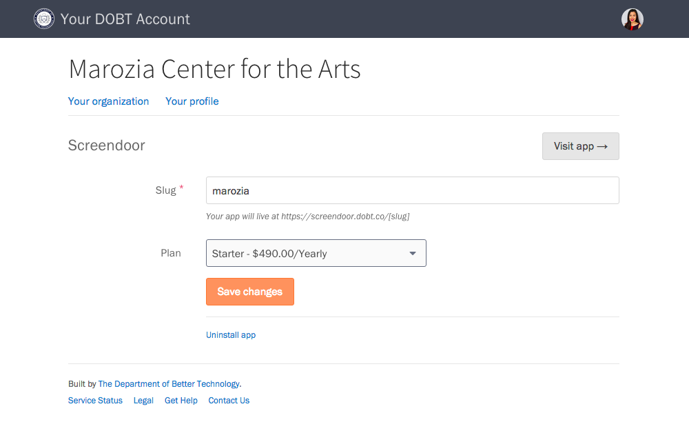

### Launching an application

To open an app you have installed, click on its name from the [&ldquo;Your organization&rdquo; page](https://dashboard.dobt.co/organization/) in the dashboard.

### Changing the URL of an application

To change an application's URL, press the &ldquo;Edit&rdquo; button next to its name on the [&ldquo;Your organization&rdquo; page](https://dashboard.dobt.co/organization/). Enter a new URL, and then press the &ldquo;Save changes&rdquo; button. Note that your URL must be unique: if a URL has already been taken by another organization, we'll ask you to choose another.

### Adding or changing a plan

On the [&ldquo;Your organization&rdquo; page](https://dashboard.dobt.co/organization/), click the &ldquo;Edit&rdquo; button next to an application's name. Under &ldquo;Plan,&rdquo; select a plan from the dropdown and click the &ldquo;Save changes&rdquo; button. (If you don't have a credit card on file with us, you will see an &ldquo;Enter payment information&rdquo; button instead.)

See the [Billing](billing.html) article for more information. If you're on a custom plan and would like to change it, please contact us at [hello@dobt.co](mailto:hello@dobt.co).

### Removing an application

From the &ldquo;Your organization&rdquo; page, click the &ldquo;Edit&rdquo; button next to the application's name. Click the &ldquo;Uninstall app&rdquo; link to remove the application.

