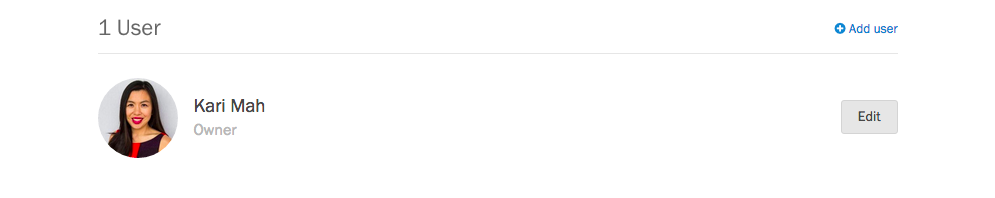
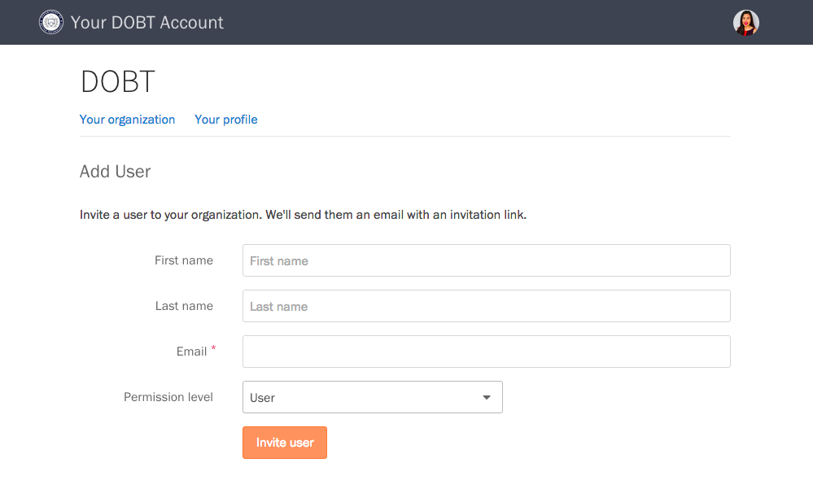

### Inviting new users

If you are an administrator in your organization, you can add users from the [&ldquo;Your organization&rdquo; page](https://dashboard.dobt.co/organization/). Scroll down to the Users section, and press the &ldquo;Add user&rdquo; button. 

Fill out the form, press the &ldquo;Invite user&rdquo; button. The invited user will receive a link to sign up for a DOBT account, after which they will be added to your organization.

### Managing user permissions

When you add a user, you can choose the appropriate permission level for that user from the &ldquo;Permission level&rdquo; dropdown on the &ldquo;Add User&rdquo; page.

To manage permissions for an existing user, select the user from the [&ldquo;Your organization&rdquo; page](https://dashboard.dobt.co/organization/). Then, choose a permission level from the &ldquo;Permission level&rdquo; dropdown. For app-specific permissions, select the appropriate permissions under &ldquo;App permissions.&rdquo;

### Resetting a user's password

Point the user to the [Signing in](signup_and_login.html) article, or have them email us at [support@dobt.co](mailto:support@dobt.co?subject=Reset password request).

### Removing users

On the &ldquo;Your organiztion&rdquo; page, click on the user you'd like to remove. On the bottom of that user's page, click the &ldquo;Remove from staff&rdquo; link, and confirm you want to delete that user in the modal dialog that appears.
