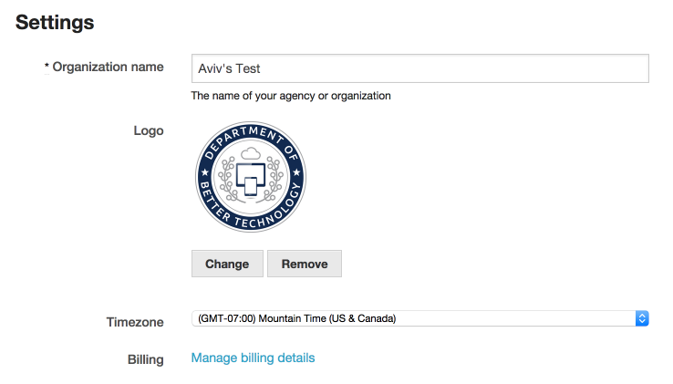

To change the name of your organization, or add a logo, scroll down to the ["Your organization" page](https://dashboard.dobt.co/organization/). If you are an administrator of your organization, you can change your organization's name, and add a logo.

To change a logo you have previously uploaded, click the "Remove" button to delete your current logo. Then, choose a new logo to upload.

Remember to press the "Save changes" button to save your new settings.
