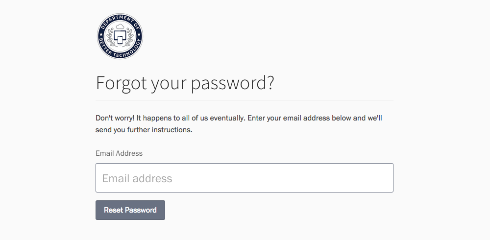

    **Note**: If you have a Screendoor account, sign in by [following the instructions here](../../screendoor/your_account/sign_in.html).

To view and edit your DOBT account, visit the [Sign In page](https://dashboard.dobt.co/sign_in). You'll need the email address you signed up with, as well as the password you created.

### Resetting your password

If you forgot your password, click the "Forgot?" button on the Sign In page. This will take you to the ["Forgot your password?" page](https://dashboard.dobt.co/users/password/new), where you can enter your email address to start the password reset process.

---

## F.A.Q.

### My password isn't working. Help!

If your password isn't working, make sure that you're signing in with the correct email address and confirm that your Caps Lock key is off. If it still isn't working, click the "Forgot?" button to the right of the password field to reset your password.

### What should I do if I've tried to reset my password, but have not received the email?

First, make sure that you submitted the correct email address, and check your spam folder to make sure the reset email wasn't accidentally filtered.

If it's been a while and you still haven't received an email, contact us at [support@dobt.co](mailto:support@dobt.co).
